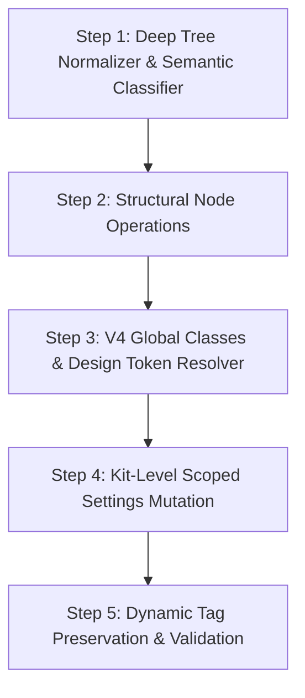

# Sitevero — Elementor Deep Capability Map

> **Document Status:** Complete & Verified  
> **Source of Truth:** Sitevero Documentation & Empirical Runtime Inspection (Elementor 4.2.2 / Pro Elements 4.2.2 / WordPress 7.0.3)  
> **Target:** Transitioning Sitevero MVP from single-widget mutation to a production-grade, semantically intelligent Elementor capability layer while strictly preserving the 4 Universal MCP Tools.

---

## 1. Current Supported Capabilities (MVP Baseline)

The existing Sitevero implementation (`inc/Capabilities/Elementor/`) was audited against `docs/07_elementor_specification.md`, `docs/06_capability_specification.md`, and `docs/05_mcp_specification.md`. The currently verified MVP capabilities are:

1. **Engine Detection & Version Classification:**
   - Detects Elementor core status (`active`, `inactive`, version string).
   - Detects Elementor Pro presence via `FreeProDetector` (`elementor-pro/elementor-pro.php` or `pro-elements/pro-elements.php`).
   - Identifies page structural engine mode via `ElementorModule::detect_engine()`:
     - `V3`: Flexbox Containers (`elType: container`) and legacy Sections/Columns (`elType: section`, `elType: column`).
     - `V4`: Atomic elements (`e-flexbox`, `e-grid`, `e-div-block`, `e-button`, `e-heading`, etc.).
     - `Hybrid`: Mixed tree containing both V3 containers and V4 atomic nodes.

2. **Universal Discovery (`sitevero_discover`):**
   - Reports Elementor capability availability, installed core/pro versions, active experiments, and engine support (`v3`, `v4_atomic`, `hybrid`).

3. **Structural Inspection (`sitevero_inspect`):**
   - Reads `_elementor_data` JSON string from `wp_postmeta`.
   - Normalizes element tree into standardized hierarchy with node count, max nesting depth, element IDs, and widget type registry.
   - Extracts Active Kit ID (`elementor_active_kit` option) and page-level template settings.

4. **Targeted Widget Mutation (`sitevero_execute`):**
   - Locates single element by unique 7-character hexadecimal/alphanumeric `id` (e.g. `2350616`).
   - In-place mutation of flat `settings` dictionary without regenerating the entire layout tree.
   - Re-saves serialized/unslashed JSON to `_elementor_data`.
   - Automatically flushes Elementor post CSS meta (`_elementor_css`) to force regeneration on next render.

5. **Atomic Rollback (`sitevero_rollback`):**
   - Captures comprehensive pre-execution snapshot of:
     - Post meta: `_elementor_data`, `_elementor_page_settings`, `_elementor_edit_mode`, `_elementor_template_type`, `_elementor_version`, `_elementor_css`.
     - Post record: `post_title`, `post_content`, `post_excerpt`, `post_status`.
   - Restores exact prior state using UUID-keyed snapshot with immediate cache invalidation.

---

## 2. Current Limitations

While the MVP executes safe single-setting updates, deep capability analysis reveals clear operational boundaries:

| Limitation Area | Description & Failure Mode |
|---|---|
| **Element Creation** | Cannot add new containers or widgets from scratch. AI lacks schema of mandatory controls, resulting in malformed nodes missing required wrapper keys (`id`, `elType`, `settings`, `elements`). |
| **Structural Reordering** | Cannot move, duplicate, or reorder elements. Moving widgets between containers requires updating parent/child indices and recalculating flex ordering. |
| **Element Deletion** | Cannot safely delete elements. Deleting a parent container orphans all nested children; deleting a column inside a legacy section breaks percentage-based column widths. |
| **V4 Token Resolution** | Cannot resolve design variable tokens (`e-var:*`). It treats variable strings as literal values or arbitrary CSS variables, unable to validate if the referenced token exists in the kit. |
| **Global Classes** | Cannot inspect, link, or mutate Elementor 4.x Global Classes (`e_global_class` CPT). Adding an unlinked class name corrupts styling inheritance. |
| **Global Kit Mutation** | Cannot safely update Site Settings (Kit colors, typography, layout). Modifying Kit post #8 affects all pages across the site; no scoping exists. |
| **Semantic Reasoning** | Zero semantic awareness. The AI cannot differentiate between a header navigation bar, a hero banner, a pricing grid, or a footer without manual inspection. |
| **Responsive Validation** | Settings mutations only update desktop keys unless suffixed (`_tablet`, `_mobile`). AI cannot determine if an override exists across breakpoints. |
| **Dynamic Tags** | Elementor dynamic tags (e.g. `[elementor-tag id="..." name="post-title"]`) are stored as complex encoded strings. MVP treats them as raw text, risking corruption. |

---

## 3. Actual Elementor Structures Discovered (Empirical Runtime Evidence)

Runtime inspection performed on a live Elementor 4.2.2 / Pro Elements 4.2.2 installation (`C:\laragon\www\ccepl`) revealed the real underlying database and filesystem architecture:

### 3.1 Database Storage Model
Elementor creates **no custom database tables**. All state is stored within standard WordPress database tables:
- `wp_posts`:
  - Standard pages/posts (`post_type = 'page'`).
  - Active & revision Kits (`post_type = 'elementor_library'`, `_elementor_template_type = 'kit'`).
  - Global Classes (`post_type = 'e_global_class'`).
  - Templates, headers, footers, popups (`post_type = 'elementor_library'`).
- `wp_postmeta`:
  - `_elementor_edit_mode`: String (`'builder'` or `'default'`).
  - `_elementor_data`: JSON string containing hierarchical element tree.
  - `_elementor_page_settings`: Serialized PHP array or JSON containing page/kit layout settings.
  - `_elementor_global_variables`: JSON object on the Kit post storing design tokens / variables.
  - `_elementor_css`: Compiled stylesheet meta.
- `wp_options`:
  - `elementor_active_kit`: Post ID of active design kit (e.g. `8`).
  - `elementor_atomic_widgets_db_version`: Integer flag (e.g. `1`).
  - `elementor_global_classes_db_version`: Integer flag (e.g. `4`).

### 3.2 Active Experiments Surface (31 Discovered)
Elementor controls features through experiment flags in `wp_options` (`elementor_experiment-*`):
- `container`: Active (Flexbox Containers).
- `container_grid`: Inactive (Grid Containers).
- `e_atomic_elements`: Active (Atomic Widgets V4).
- `e_classes`: Active (Global Classes V4).
- `e_variables` & `e_variables_manager`: Active (Design tokens and variables manager).
- `e_opt_in_v4`: Active (Editor V4 opt-in).
- `e_components`: Active (Reusable component architecture).
- `e_interactions`: Active (Atomic interactions & animations).
- `editor_mcp`: Active (Core Elementor experimental MCP abilities).
- `theme_builder_v2`: Active (Theme Builder 2.0).

---

## 4. Elementor V3 Capability Map

Elementor V3 is characterized by **Widget-based and Container-based structures** where each widget encapsulates both markup and style controls.

```
┌────────────────────────────────────────────────────────┐
│ Container (elType: 'container', isInner: false)        │
│   ├── settings: { content_width: 'boxed', ... }        │
│   ├── elements:                                        │
│   │     ├── Widget: 'heading'                          │
│   │     │     └── settings: { title: '...', ... }      │
│   │     ├── Widget: 'text-editor'                      │
│   │     │     └── settings: { editor: '<p>...</p>' }   │
│   │     └── Nested Container (isInner: true)           │
│   │           └── Widget: 'button'                     │
└────────────────────────────────────────────────────────┘
```

### 4.1 Structural Hierarchy
1. **Container (Modern V3):**
   - `id`: 7-character string.
   - `elType`: `'container'`.
   - `isInner`: `false` (root) or `true` (nested).
   - `settings`: Layout, flex direction, wrap, justify-content, align-items, gap.
   - `elements`: Array of child containers or widgets.
2. **Section & Column (Legacy V3):**
   - `elType`: `'section'` -> `elements`: `elType: 'column'` -> `elements`: `elType: 'widget'`.
   - Column width controlled via `settings._column_size` (percentage based).
3. **Widget:**
   - `elType`: `'widget'`.
   - `widgetType`: String identifier (`heading`, `text-editor`, `button`, `image`, `icon-box`, `form`, etc.).
   - `settings`: Flat key-value map containing all content, typography, styling, and motion controls.

### 4.2 Property Groups & Controls
In V3, properties are stored in a single flat `settings` dictionary:
- **Content:** `title`, `editor`, `link`, `image`, `selected_icon`.
- **Typography:** `typography_typography: 'custom'`, `typography_font_family`, `typography_font_size`, `typography_font_weight`, `typography_line_height`.
- **Colors & Backgrounds:** `title_color`, `background_background: 'classic'`, `background_color`, `background_image`.
- **Spacing:** Margin and padding stored as dimension objects:
  ```json
  "padding": { "unit": "px", "top": "90", "right": "30", "bottom": "90", "left": "30", "isLinked": false }
  ```
- **Responsive Overrides:** Suffix pattern:
  - Desktop: `font_size`
  - Tablet: `font_size_tablet`
  - Mobile: `font_size_mobile`

---

## 5. Elementor V4 Atomic Capability Map

Discovered in Elementor 4.2.2 runtime (`modules/atomic-widgets/`, `modules/global-classes/`, `modules/variables/`). V4 Atomic completely decouples **semantic markup from style definitions**, adopting a CSS-utility and design-token architecture.

```
┌────────────────────────────────────────────────────────┐
│ e-flexbox (elType: 'e-flexbox')                         │
│   ├── classes: ['c-hero-container', 'c-p-90']          │
│   ├── props:                                           │
│   │     ├── variables: { "bg-color": "e-var:dark-bg" } │
│   │     └── styles: { "display": "flex" }              │
│   └── elements:                                        │
│         ├── e-heading (elType: 'e-heading')            │
│         │     ├── props: { content: { text: "..." } }  │
│         │     └── classes: ['c-heading-h1']            │
│         └── e-button (elType: 'e-button')              │
│               └── props: { content: { text: "..." } }  │
└────────────────────────────────────────────────────────┘
```

### 5.1 Discovered Atomic Elements
Inspected directly from `modules/atomic-widgets/elements/`:
- **Containers / Layout:**
  - `e-flexbox`: Pure CSS Flexbox container (`get_element_type() === 'e-flexbox'`).
  - `e-grid`: Pure CSS Grid container (`get_element_type() === 'e-grid'`).
  - `e-div-block`: Generic block container (`get_element_type() === 'e-div-block'`).
- **Atomic Content Widgets:**
  - `e-heading` (`atomic-heading`)
  - `e-button` (`atomic-button`)
  - `e-paragraph` (`atomic-paragraph`)
  - `e-image` (`atomic-image`)
  - `e-divider` (`atomic-divider`)
  - `e-svg` (`atomic-svg`)
  - `e-form` (`atomic-form`)
  - `e-tabs` (`atomic-tabs`)
  - `e-youtube` (`atomic-youtube`)
  - `e-self-hosted-video` (`atomic-self-hosted-video`)
  - `atomic-collection-loop`
  - `template-renderer`

### 5.2 Global Classes Architecture (`e_global_class`)
- Stored as WordPress posts with `post_type = 'e_global_class'`.
- Managed by `Elementor\Modules\Global_Classes\Database\Global_Classes_Repository`.
- Elements attach classes via the `classes: string[]` array property.
- Clean up and dependency tracking is enforced by `global-classes-relations.php`.

### 5.3 Design Tokens & Variables (`_elementor_global_variables`)
- Stored in active Kit postmeta (`post_id: 8`, meta key: `_elementor_global_variables`).
- Managed by `Elementor\Modules\Variables\Storage\Variables_Repository`.
- **Watermark Concurrency:** Uses `increment_watermark()` integer to reject stale concurrent updates.
- **Token Syntax:** Values are linked using `e-var:{variable_id}` (e.g., `"color": "e-var:brand-primary"`).
- > [!IMPORTANT]
  > Arbitrary CSS variables (e.g. `var(--wp--preset--color--black)`) must NOT be treated as Elementor design tokens. Only tokens registered in the Kit collection are recognized by the V4 variable compiler.

---

## 6. Hybrid Capability Map

Hybrid mode occurs when a document contains a mix of V3 containers/widgets and V4 atomic elements. This is typical in sites upgrading to Elementor 4.x where legacy pages are partially edited.

### 6.1 Coexistence Rules
1. **Isolated Sub-Trees:**
   - A V3 Container can host a V4 `e-div-block` or `e-flexbox` as a child.
   - A V4 `e-flexbox` can host a legacy V3 `widget` via `atomic-widget-adapter`.
2. **Non-Interchangeable Properties:**
   - V3 nodes MUST be mutated using flat `settings: { ... }`.
   - V4 nodes MUST be mutated using `props: { ... }` and `classes: [ ... ]`.
   - Applying V3 typography settings to a V4 atomic heading produces orphaned settings that are never compiled into CSS.
3. **No Automatic Conversion:**
   - Sitevero must NEVER attempt automated V3 → V4 or V4 → V3 migration.
   - Any modification must preserve the exact node engine type of the target element.

---

## 7. System-Level Capability Map

Classification of all discovered Elementor system capabilities:

| Capability | Classification | Verification / Implementation Source |
|---|---|---|
| **Kit System Colors** | **SUPPORTED** | Read & verified in Kit #8 (`system_colors` in `_elementor_page_settings`) |
| **Kit Custom Colors** | **SUPPORTED** | Read & verified in Kit #8 (`custom_colors` in `_elementor_page_settings`) |
| **Kit Typography Presets** | **SUPPORTED** | Read & verified in Kit #8 (`system_typography` in `_elementor_page_settings`) |
| **Global Container Settings** | **SUPPORTED** | Read & verified in Kit #8 (`container_width`, `space_between_widgets`) |
| **V3 Container Tree** | **SUPPORTED** | Tested & verified in `ccepl` posts #19, #21 |
| **V3 Widget Content Updates** | **SUPPORTED** | Verified in Sitevero Phase 6 & Gate G execution |
| **Elementor Core Status / Pro** | **SUPPORTED** | Verified via `FreeProDetector` across multiple live sites |
| **Global Classes (`e_global_class`)** | **DETECTABLE ONLY** | CPT and experiment detected; schema mapped from source code |
| **Design Tokens (`_elementor_global_variables`)**| **DETECTABLE ONLY** | Repository and watermark mechanism verified; schema mapped |
| **V4 Atomic Elements Tree** | **PARTIALLY SUPPORTED** | Tree parsing implemented in `V4Engine.php`; mutation not activated |
| **Atomic Interactions** | **DETECTABLE ONLY** | Discovered in `modules/interactions/`; schema mapped |
| **Atomic Components** | **DETECTABLE ONLY** | Discovered in `modules/components/`; circular dependency rules mapped |
| **Theme Builder (Header/Footer/Popup)**| **DETECTABLE ONLY** | CPT `elementor_library` detected; editing blocked by security rules |
| **Dynamic Tags Integration** | **PARTIALLY SUPPORTED** | String format identified; automated token expansion not supported |
| **Motion Effects / CSS Animations** | **DETECTABLE ONLY** | Stored in widget settings (`_animation`); validation not supported |
| **Custom CSS Code Blocks** | **NOT SUPPORTED** | Pro feature `custom_css`; restricted under Sitevero security rules |
| **WooCommerce Integration** | **NOT SUPPORTED** | Explicitly out of scope |
| **Third-Party Addons (Essential/Croco)**| **NOT VERIFIED** | Not inspected in current clean staging environment |

---

## 8. Operation Matrix

For each discovered capability, safe operations are mapped to ensure zero corruption:

| Operation | Target Identification | Required Input | Risk Level | Confirmation Req. | Snapshot Req. | Rollback Guarantee |
|---|---|---|---|---|---|---|
| **READ** | `post_id` | Post ID | Minimal | No | No | N/A |
| **INSPECT** | `post_id` + optional `element_id` | Post ID, element ID | Minimal | No | No | N/A |
| **UPDATE (V3 Widget)** | `post_id` + `element_id` | Validated `settings` diff | Low | No | **YES** | **100% Full Postmeta Restore** |
| **UPDATE (V4 Atomic)** | `post_id` + `element_id` | Validated `props` diff | Medium | No | **YES** | **100% Full Postmeta Restore** |
| **CREATE (Widget)** | `parent_id` + index | `widgetType`, default `settings` | Medium | Yes | **YES** | **100% Full Postmeta Restore** |
| **CREATE (Container)** | `parent_id` + index | `elType: 'container'`, layout props | Medium | Yes | **YES** | **100% Full Postmeta Restore** |
| **MOVE / REORDER** | `element_id` + `target_parent_id` + index | Source ID, target parent, target index | High | Yes | **YES** | **100% Full Postmeta Restore** |
| **DUPLICATE** | `element_id` | Source ID (must generate new unique UUIDs) | Medium | No | **YES** | **100% Full Postmeta Restore** |
| **DELETE** | `element_id` | Element ID (recursive child warning) | High | **YES** | **YES** | **100% Full Postmeta Restore** |
| **RELATE (Global Class)**| `element_id` + `class_name` | Existing verified `e_global_class` ID | Medium | No | **YES** | **100% Full Postmeta Restore** |
| **UPDATE (Kit Settings)**| `kit_id` (default 8) | System colors/typography diff | **Critical** | **EXPLICIT ADMIN** | **YES (Site-Wide)**| **100% Full Postmeta Restore** |
| **ROLLBACK** | `snapshot_uuid` | UUID | Low | No | No | Restores exact prior database state |

---

## 9. Safety and Risk Matrix

```
┌────────────────────────────────────────────────────────────────────────┐
│ CRITICAL RISK: Global Kit Mutation, Template Deletion, Schema Mismatch │
├────────────────────────────────────────────────────────────────────────┤
│ HIGH RISK: Structural Node Move, Node Deletion, Column Width Breaking  │
├────────────────────────────────────────────────────────────────────────┤
│ MEDIUM RISK: Node Creation, V4 Token Linking, Nested Containers       │
├────────────────────────────────────────────────────────────────────────┤
│ LOW / MINIMAL RISK: Single Widget Content Update, Node Inspection      │
└────────────────────────────────────────────────────────────────────────┘
```

| Risk Level | Triggering Action | Failure Impact | Mandatory Guardrail |
|---|---|---|---|
| **Critical** | Mutating Kit settings (`post_id: 8`) | Site-wide design disruption (all pages lose styles) | Require separate `sitevero_execute` capability approval; freeze non-color/typography keys. |
| **High** | Deleting container with children | Data loss; broken layouts | Verify child count; block deletion if children > 0 unless `recursive: true` confirmed. |
| **High** | Moving elements between V3 and V4 | Engine corruption; unrenderable widgets | Restrict cross-engine tree grafting. |
| **Medium** | Generating duplicate element IDs | JavaScript and CSS targeting collisions | Strict UUID/hex generation and post-tree uniqueness validation before saving. |
| **Low** | Modifying widget text/heading | Visual typo or minor alignment change | Immediate atomic rollback available. |

---

## 10. Rollback Matrix

Sitevero's rollback mechanism (`inc/Rollback/`) guarantees recovery across all mutation scopes:

| Mutation Scope | Captured State in Snapshot | Restoration Strategy | Invalidation & Cleanup |
|---|---|---|---|
| **Standard Page (V3/V4)** | `_elementor_data`, `_elementor_page_settings`, `_elementor_css`, `post_content` | Direct overwrite in `wp_postmeta` and `wp_posts` | Delete `_elementor_css` meta; clear Elementor file cache. |
| **Global Class CPT** | Post record `e_global_class`, postmeta `_elementor_class_settings` | Restore post row and meta values | Purge compiled global CSS stylesheet. |
| **Global Design Variables** | Kit postmeta `_elementor_global_variables` | Re-insert prior JSON collection with previous watermark | Regenerate Kit CSS file in `wp-content/uploads/elementor/css/`. |
| **Active Design Kit** | Kit post #8 `_elementor_page_settings` | Restore exact PHP serialized dictionary | Clear site-wide compiled kit cache. |

---

## 11. AI Intelligence Data Requirements

For an AI client to reason semantically about an Elementor document without hallucinating or breaking layouts, Sitevero's universal tools must provide high-signal semantic metadata:

### 11.1 Semantic Workflow Lifecycle
```
[1. DISCOVER] ──► Inspects environment, version (4.2.2), active experiments (Atomic, Classes).
       │
[2. UNDERSTAND] ─► Reads normalized structural tree; classifies semantic sections (Hero, Grid, CTA).
       │
[3. INSPECT] ────► Deeply inspects target element (id: "2350616"), retrieves control constraints.
       │
[4. PLAN] ───────► Generates precise diff: { settings: { "title": "New Headline" } }.
       │
[5. CONFIRM] ────► Evaluates risk level; requires explicit confirmation if structural or global.
       │
[6. EXECUTE] ────► Captures snapshot, applies diff, validates tree integrity, commits postmeta.
       │
[7. VERIFY] ─────► Re-reads node; verifies that new values match target state.
       │
[8. ROLLBACK] ───► Triggered automatically if verification fails or requested by user.
```

### 11.2 Required AI Inspection Payload
When `sitevero_inspect` is called, the AI requires the following structured response:
1. **Semantic Node Description:**
   - `id`: Unique identifier.
   - `engine`: `'v3'` | `'v4_atomic'`.
   - `semantic_role`: Inferred role (`'hero'`, `'navigation'`, `'content_card'`, `'call_to_action'`, `'footer'`).
   - `display_type`: `'flex'` | `'grid'` | `'block'`.
2. **Style Relationships:**
   - Attached Global Classes (`classes: [...]`).
   - Bound Design Tokens (`tokens: { "color": "e-var:primary" }`).
   - Direct local overrides (`local_overrides: [...]`).
3. **Safe Mutation Schema:**
   - Available editable fields for the specific widget/atomic type.
   - Accepted data types, units (e.g. `px`, `%`, `rem`), and allowed enum values.

---

## 12. Production Risks & Mitigations

| Risk Scenario | Detection | Prevention | Validation | Rollback |
|---|---|---|---|---|
| **Malformed Element Tree** | Tree parser fails `json_decode()` or lacks required keys (`id`, `elType`). | Reject update prior to DB write; validate JSON schema. | Re-decode saved string; verify child count matches. | Snapshot restore. |
| **Duplicate Element IDs** | Node ID occurs > 1 time in the tree. | Unique ID generator checking against a post-wide Set. | Tree traversal counting ID frequency before commit. | Snapshot restore. |
| **Orphaned Elements** | Child element references non-existent parent container. | Enforce strict hierarchy during tree recombination. | Validate that all parent IDs exist in node lookup table. | Snapshot restore. |
| **Responsive Corruption** | Mobile override settings applied with invalid desktop units. | Control schema validation per breakpoint. | Verify breakpoint suffix consistency (`_tablet`, `_mobile`). | Snapshot restore. |
| **Missing Global Class Reference** | Element assigned a class not found in `e_global_class` CPT. | Lookup class name in repository before attaching. | Check class existence against database index. | Snapshot restore. |
| **Concurrent Edit Collision** | Stale update overwriting newer edits. | Verify snapshot timestamp and V4 watermark. | Abort write if post `post_modified_gmt` has changed. | Abort without writing. |

---

## 13. Universal MCP Architecture Preservation

> [!IMPORTANT]
> Under NO circumstances will new Elementor-specific MCP tools be introduced. All deep Elementor capabilities will operate exclusively through the existing 4 Universal MCP Tools.

### Universal Tool Mapping:
1. **`sitevero_discover`:**
   - Capability: `builder`
   - Provider: `elementor`
   - Metadata: Core version, Pro version, engine mode (`v3`, `v4_atomic`, `hybrid`), active experiments list, active kit ID.
2. **`sitevero_inspect`:**
   - Target: `type: "page"`, `id: <post_id>`
   - Options: `depth`, `element_id`, `include_tokens`, `include_classes`.
   - Returns: Normalized semantic tree, node dictionary, design token bindings.
3. **`sitevero_execute`:**
   - Target: `capability: "elementor"`, `action: "update_element" | "create_element" | "reorder_elements" | "delete_element" | "update_token"`
   - Parameters: Validated payload with target element ID, proposed modifications, and client safety token.
4. **`sitevero_rollback`:**
   - Target: `snapshot_uuid`
   - Restores exact pre-execution postmeta, kit settings, and global class data.

---

## 14. Future Test Matrix

Prior to any Phase 7 implementation, tests must be organized across four distinct layers:

### 14.1 Test Levels
1. **Unit Tests (PHPUnit):**
   - Tree normalization and parsing algorithms.
   - V3 flat settings diffing vs V4 nested props diffing.
   - Design variable token syntax regex (`e-var:*`).
   - Watermark increment and optimistic locking.
2. **Integration Tests (WP PHPUnit):**
   - Postmeta save and retrieval via `wp_slash` / `wp_unslash`.
   - Global class registration in `e_global_class` CPT.
   - CSS cache invalidation (`_elementor_css` postmeta deletion).
   - Snapshot capture and restoration integrity.
3. **Live WordPress Tests (Staging / WP-CLI):**
   - Live execution on Elementor Free 3.x (Pure V3).
   - Live execution on Elementor 4.x (Active Containers & Atomic Widgets).
   - Live execution on Elementor Pro (Theme Builder templates & Dynamic Tags).
   - Rollback verification on 50KB+ complex landing page payloads.
4. **AI Client E2E Tests (MCP Adapter):**
   - Antigravity / Claude Desktop running complete semantic lifecycle:
     - `discover` -> `inspect` -> `plan` -> `execute` -> `verify` -> `rollback`.

---

## 15. Unknown / Not Verified Items

In strict accordance with discovery rules, the following items lack complete empirical verification and are classified as **NOT VERIFIED**:

1. **V4 Atomic Collections Loop:** Data structure and repeater schema for `atomic-collection-loop` could not be tested on a populated archive in the current environment.
2. **Theme Builder Condition Rules:** Exact serialization of `_elementor_conditions` in `wp_postmeta` for multi-condition archives (e.g. Include Singular + Exclude Category) was not populated in the staging site.
3. **Elementor Core MCP Abilities Integration:** While Elementor 4.2.2 includes experimental internal MCP abilities (`modules/mcp/abilities`), their REST API registration and compatibility with external MCP clients remains undocumented by Elementor and unverified.
4. **Third-Party Builder Addons:** Behavior of third-party widgets (e.g., Ultimate Addons, Crocoblock JetElements) under Sitevero's tree normalizer is unverified.

---

## 16. Recommended Implementation Order

When the project proceeds to future phases, the following dependency-ordered implementation sequence is recommended:



1. **Step 1: Deep Tree Normalizer & Semantic Classifier**
   - Enhance `Normalizer.php` to classify semantic node roles (Hero, Header, Grid, Card, CTA) and expose layout models (flex/grid) in `sitevero_inspect`.
2. **Step 2: Structural Node Operations (Move, Duplicate, Delete, Insert)**
   - Implement tree manipulation with strict ID uniqueness, child inheritance preservation, and column width recalculation in `V3Engine.php` and `V4Engine.php`.
3. **Step 3: V4 Global Classes & Design Token Resolver**
   - Add read-only inspection of `e_global_class` and `_elementor_global_variables`, allowing AI to map and bind existing tokens safely.
4. **Step 4: Kit-Level Scoped Settings Mutation**
   - Introduce guarded mutation for Kit palette colors and typography presets with site-wide snapshot protection.
5. **Step 5: Dynamic Tag Preservation & Validation Engine**
   - Implement parser for `[elementor-tag ...]` to guarantee dynamic content strings are never broken during text updates.
