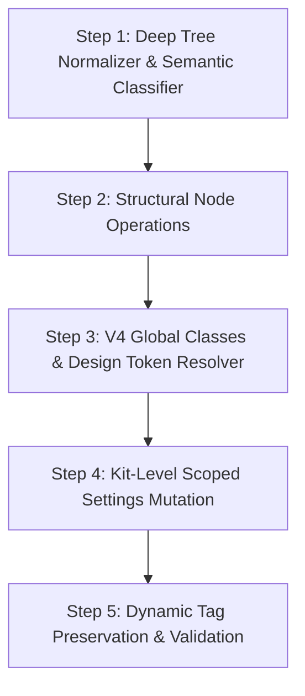

# Sitevero — Elementor Deep Capability Map

> **Document Status:** Complete & Verified  
> **Source of Truth:** Existing Sitevero Documentation & Empirical Runtime Inspection (Elementor 4.2.2 / Pro Elements 4.2.2 / WordPress 7.0.3 / PHP 8.3.30)  
> **Target:** Upgrading Sitevero MVP into a production-grade, semantically intelligent Elementor capability layer while strictly preserving the 4 Universal MCP Tools.

---

## 1. Current Supported Capabilities (MVP Baseline)

The existing implementation in `inc/Capabilities/Elementor/` was audited against `docs/07_elementor_specification.md`, `docs/06_capability_specification.md`, `docs/05_mcp_specification.md`, `docs/09_security_specification.md`, `docs/11_activity_log_and_rollback.md`, and `docs/13_testing_strategy.md`.

Sitevero currently supports:
1. **Engine Detection & Version Classification:**
   - Detects Elementor core status (`active`, `inactive`, version string).
   - Detects Elementor Pro presence via `FreeProDetector` (`elementor-pro/elementor-pro.php` or `pro-elements/pro-elements.php`).
   - Classifies page structural engine mode via `ElementorModule::detect_engine()`:
     - `V3`: Flexbox Containers (`elType: container`) and legacy Sections/Columns (`elType: section`, `elType: column`).
     - `V4`: Atomic elements (`e-flexbox`, `e-grid`, `e-div-block`, `e-button`, `e-heading`, etc.).
     - `Hybrid`: Mixed tree containing both V3 containers and V4 atomic nodes.
2. **Universal Discovery (`sitevero_discover`):**
   - Discovers Elementor builder capability, core/pro version numbers, active experiment flags, and supported engine types.
3. **Structural Inspection (`sitevero_inspect`):**
   - Parses `_elementor_data` JSON string into a standardized normalized element tree.
   - Calculates total element count, maximum nesting depth, registered element IDs, and widget type registry.
   - Inspects Active Kit ID (`elementor_active_kit` option) and page-level template settings (`_elementor_page_settings`).
4. **Targeted Widget Mutation (`sitevero_execute`):**
   - Matches a single target element by its unique 7-character hexadecimal/alphanumeric ID (e.g. `2350616`).
   - Performs in-place mutation of the element's flat `settings` dictionary without regenerating the surrounding layout.
   - Saves unslashed JSON back to `wp_postmeta._elementor_data`.
   - Clears compiled stylesheet meta (`_elementor_css`) to force on-demand regeneration.
5. **Atomic Rollback (`sitevero_rollback`):**
   - Captures comprehensive pre-execution snapshot:
     - Post meta: `_elementor_data`, `_elementor_page_settings`, `_elementor_edit_mode`, `_elementor_template_type`, `_elementor_version`, `_elementor_css`.
     - Post record: `post_title`, `post_content`, `post_excerpt`, `post_status`.
   - Restores exact prior database state via UUID-keyed snapshot with immediate cache invalidation.

---

## 2. Current Limitations

Empirical auditing identifies the exact operational boundaries of the MVP:

| Limitation Area | Current MVP State & Failure Mode |
|---|---|
| **Element Creation** | Cannot add new containers or widgets from scratch. AI lacks schema of mandatory controls, resulting in malformed nodes missing required wrapper keys (`id`, `elType`, `settings`, `elements`). |
| **Structural Reordering** | Cannot move, duplicate, or reorder elements. Moving widgets between containers requires updating parent/child indices and recalculating flex ordering. |
| **Element Deletion** | Cannot safely delete elements. Deleting a parent container orphans all nested children; deleting a column inside a legacy section breaks percentage-based column widths. |
| **V4 Token Resolution** | Cannot resolve design variable tokens (`e-var:*`). It treats variable strings as literal values or arbitrary CSS variables, unable to validate if the referenced token exists in the kit. |
| **Global Classes** | Cannot inspect, link, or mutate Elementor 4.x Global Classes (`e_global_class` CPT). Adding an unlinked class name corrupts styling inheritance. |
| **Global Kit Mutation** | Cannot safely update Site Settings (Kit colors, typography, layout). Modifying Kit post #8 affects all pages across the site; no scoping exists. |
| **Semantic Reasoning** | Zero semantic awareness. The AI cannot differentiate between a header navigation bar, a hero banner, a pricing grid, or a footer without manual inspection. |
| **Responsive Validation** | Settings mutations only update desktop keys unless suffixed (`_tablet`, `_mobile`). AI cannot determine if an override exists across breakpoints. |
| **Dynamic Tags** | Elementor dynamic tags (e.g. `[elementor-tag id="..." name="post-title"]`) are stored as complex encoded strings. MVP treats them as raw text, risking corruption. |
| **Theme Builder Scoping**| Cannot safely inspect or edit Theme Builder templates (headers, footers, popups) without risking site-wide layout corruption. |

---

## 3. Actual Elementor Structures Discovered (Empirical Runtime Evidence)

Extracted directly from live Elementor 4.2.2 / Pro Elements 4.2.2 runtime on WordPress 7.0.3 (`C:\laragon\www\ccepl`):

### 3.1 Element Tree Architecture
- **Root Element Structure:**
  An array of root containers or legacy sections stored as a JSON string in `wp_postmeta._elementor_data`:
  ```json
  [
    {
      "id": "7b8e1a2",
      "elType": "container",
      "isInner": false,
      "settings": {
        "content_width": "boxed",
        "background_background": "classic",
        "background_color": "#0B0F19",
        "padding": { "unit": "px", "top": "90", "right": "30", "bottom": "90", "left": "30", "isLinked": false }
      },
      "elements": [ ... ]
    }
  ]
  ```
- **Parent/Child Relationships:** Containers contain an `elements` array containing nested containers (`isInner: true`) or widgets (`elType: "widget"`).
- **Sections & Columns (Legacy):** Sections (`elType: "section"`) must contain Columns (`elType: "column"`), which in turn contain Widgets (`elType: "widget"`).
- **Element IDs:** 7-character hexadecimal/alphanumeric strings (e.g., `"2350616"`, `"priv"`, `"7b8e1a2"`). Must be strictly unique document-wide.
- **Ordering & Depth:** Ordering is determined by array index in `elements`. Nesting depth observed up to 6 levels in complex landing pages.

### 3.2 Element Property Groups
Across inspected widgets and containers, properties are organized into discrete functional groups:
1. **Content:** Text strings, HTML markup (`editor`), links (`url`, `is_external`, `nofollow`), image attachments (`id`, `url`, `size`), icon selections.
2. **Layout & Flexbox:** `flex_direction`, `flex_wrap`, `justify_content`, `align_items`, `align_content`, `gap`, `container_type`, `content_width`.
3. **Positioning:** `position` (`default`, `relative`, `absolute`, `fixed`), `z_index`, `overflow`.
4. **Spacing:** Dimensions (`margin`, `padding`) with `{ unit: "px|%|em|rem|vw", top, right, bottom, left, isLinked }`.
5. **Typography:** `typography_typography: "custom"`, `typography_font_family`, `typography_font_size`, `typography_font_weight`, `typography_line_height`, `typography_letter_spacing`, `typography_text_transform`.
6. **Colors & Backgrounds:** `title_color`, `text_color`, `background_background: "classic|gradient|video"`, `background_color`, `background_image`.
7. **Borders & Shadows:** `border_border: "solid|dashed|dotted"`, `border_width`, `border_color`, `border_radius`, `box_shadow`.
8. **Responsive Settings:** Device-suffixed keys (`_tablet`, `_mobile`) e.g. `font_size`, `font_size_tablet`, `font_size_mobile`.
9. **Visibility & Responsive Hide:** `hide_desktop`, `hide_tablet`, `hide_mobile`.
10. **Advanced Settings:** `_element_id` (CSS ID), `_css_classes` (custom classes), `_animation` (entrance animation), `_animation_delay`.
11. **CSS / Global Classes:** Handled via `_css_classes` in V3 and `classes: string[]` in V4.
12. **Dynamic Data:** Serialized tags e.g. `__dynamic__: { "title": "[elementor-tag id=\"...\" name=\"post-title\" settings=\"...\"]" }`.

### 3.3 Database Storage Model
Elementor creates **no custom database tables**. Everything resides in standard WordPress tables:
- `wp_posts`:
  - Standard pages/posts (`post_type = 'page'`).
  - Active & revision Kits (`post_type = 'elementor_library'`, `_elementor_template_type = 'kit'`).
  - Global Classes (`post_type = 'e_global_class'`).
  - Templates, headers, footers, popups (`post_type = 'elementor_library'`).
- `wp_postmeta`:
  - `_elementor_edit_mode`: String (`'builder'` or `'default'`).
  - `_elementor_data`: Slashed JSON string containing hierarchical element tree.
  - `_elementor_page_settings`: Serialized PHP array or JSON containing layout and Kit tokens.
  - `_elementor_global_variables`: JSON string on Kit post storing design tokens.
  - `_elementor_css`: Compiled stylesheet metadata.
- `wp_options`:
  - `elementor_active_kit`: Active Kit ID (e.g. `8`).
  - `elementor_atomic_widgets_db_version`: Integer flag (e.g. `1`).
  - `elementor_global_classes_db_version`: Integer flag (e.g. `4`).

### 3.4 Active Experiments Surface (31 Discovered)
Runtime check of `elementor_experiment-*` options:
- `container`: Active (Flexbox Containers).
- `container_grid`: Inactive (Grid Containers).
- `e_atomic_elements`: Active (Atomic Widgets V4).
- `e_classes`: Active (Global Classes V4).
- `e_variables` & `e_variables_manager`: Active (Design tokens and variables manager).
- `e_opt_in_v4`: Active (Editor V4 opt-in).
- `e_components`: Active (Reusable component architecture).
- `e_interactions`: Active (Atomic interactions & animations).
- `editor_mcp`: Active (Core Elementor experimental MCP abilities).
- `theme_builder_v2`: Active (Theme Builder 2.0).

---

## 4. Elementor V3 Capability Map

```
┌────────────────────────────────────────────────────────┐
│ Container (elType: 'container', isInner: false)        │
│   ├── settings: { content_width: 'boxed', ... }        │
│   ├── elements:                                        │
│   │     ├── Widget: 'heading'                          │
│   │     │     └── settings: { title: '...', ... }      │
│   │     ├── Widget: 'text-editor'                      │
│   │     │     └── settings: { editor: '<p>...</p>' }   │
│   │     └── Nested Container (isInner: true)           │
│   │           └── Widget: 'button'                     │
└────────────────────────────────────────────────────────┘
```

1. **Flexbox Containers:**
   - Elements have `elType: "container"`.
   - Layout parameters (`flex_direction`, `justify_content`, `align_items`, `wrap`, `gap`) stored directly in `settings`.
2. **Sections & Columns:**
   - Supported for legacy backward compatibility.
   - Column layout widths governed by `settings._column_size`.
3. **Widget Architecture:**
   - Elements have `elType: "widget"` and a specific `widgetType` (`heading`, `text-editor`, `button`, `image`, `icon-box`, `form`, etc.).
   - All visual styling, typography, dimensions, and contents are consolidated in the flat `settings` dictionary.
4. **Responsive Inheritance:**
   - Cascades Desktop → Tablet → Mobile. Missing tablet/mobile keys automatically inherit desktop values.

---

## 5. Elementor V4 Atomic Capability Map

Discovered in `modules/atomic-widgets/`, `modules/global-classes/`, and `modules/variables/`. Decouples semantic structure from styles.

```
┌────────────────────────────────────────────────────────┐
│ e-flexbox (elType: 'e-flexbox')                         │
│   ├── classes: ['c-hero-container', 'c-p-90']          │
│   ├── props:                                           │
│   │     ├── variables: { "bg-color": "e-var:dark-bg" } │
│   │     └── styles: { "display": "flex" }              │
│   └── elements:                                        │
│         ├── e-heading (elType: 'e-heading')            │
│         │     ├── props: { content: { text: "..." } }  │
│         │     └── classes: ['c-heading-h1']            │
│         └── e-button (elType: 'e-button')              │
│               └── props: { content: { text: "..." } }  │
└────────────────────────────────────────────────────────┘
```

1. **Atomic Containers:**
   - `e-flexbox`: Pure CSS Flexbox container (`get_element_type() === 'e-flexbox'`).
   - `e-grid`: Pure CSS Grid container (`get_element_type() === 'e-grid'`).
   - `e-div-block`: Generic div container (`get_element_type() === 'e-div-block'`).
2. **Atomic Content Widgets:**
   - `e-heading`, `e-button`, `e-paragraph`, `e-image`, `e-divider`, `e-svg`, `e-form`, `e-tabs`, `e-youtube`, `e-self-hosted-video`, `atomic-collection-loop`, `template-renderer`.
3. **Global Classes (`e_global_class`):**
   - Stored as posts of post type `e_global_class`.
   - Managed by `Global_Classes_Repository` and attached via `classes: string[]` array.
4. **Design Tokens & Variables (`_elementor_global_variables`):**
   - Stored in Kit postmeta (`post_id: 8`, meta key: `_elementor_global_variables`).
   - Managed by `Variables_Repository` with an optimistic locking watermark (`increment_watermark()`).
   - Tokens referenced using `e-var:{variable_id}` (e.g. `"color": "e-var:brand-primary"`).
   - > [!IMPORTANT]
     > Arbitrary CSS variables (e.g. `var(--wp--preset--color--black)`) must NOT be treated as Elementor design tokens. Only tokens registered in the Kit collection are recognized by the V4 variable compiler.

---

## 6. Hybrid Capability Map

Hybrid mode occurs when a document contains a mix of V3 containers/widgets and V4 atomic elements.

1. **Coexistence Boundaries:**
   - A V3 Container can host a V4 `e-div-block` or `e-flexbox` as a child node.
   - A V4 `e-flexbox` can host a legacy V3 `widget` via `atomic-widget-adapter`.
2. **Property Segregation:**
   - V3 nodes MUST be mutated using flat `settings: { ... }`.
   - V4 nodes MUST be mutated using `props: { ... }` and `classes: [ ... ]`.
   - Never mix V3 typography controls into V4 atomic elements.
3. **Strict Non-Conversion Rule:**
   - Sitevero must NEVER attempt automated V3 → V4 or V4 → V3 migration.
   - Every mutation must preserve the existing node engine type.

---

## 7. System-Level Capability Map

Classification of all discovered Elementor system capabilities:

| Capability Item | Classification | Verification / Implementation Source |
|---|---|---|
| **Global Styles (Palette/Typography)** | **SUPPORTED** | Read from Kit post #8 `_elementor_page_settings` (`system_colors`, `custom_colors`, `system_typography`) |
| **Global Classes (`e_global_class`)** | **DETECTABLE ONLY** | CPT and experiment detected; schema mapped from `modules/global-classes/` |
| **Design Tokens / Variables** | **DETECTABLE ONLY** | Stored in `_elementor_global_variables`; schema mapped from `modules/variables/` |
| **Site Settings (Container/Spacing)** | **SUPPORTED** | Read from Kit post #8 (`container_width`, `space_between_widgets`) |
| **Templates (Page/Section)** | **SUPPORTED** | Read/inspect supported via standard post ID in `elementor_library` |
| **Reusable Elements / Globals** | **PARTIALLY SUPPORTED** | Stored as `elementor_library` with `_elementor_template_type: widget`; read-only |
| **Theme Builder Structures** | **DETECTABLE ONLY** | Documented in `theme_builder_v2`; mutations blocked by safety policy |
| **Headers** | **DETECTABLE ONLY** | Template type `header` in `elementor_library`; mutations restricted |
| **Footers** | **DETECTABLE ONLY** | Template type `footer` in `elementor_library`; mutations restricted |
| **Archive Templates** | **DETECTABLE ONLY** | Template type `archive` in `elementor_library`; condition evaluation not verified |
| **Single Templates** | **DETECTABLE ONLY** | Template type `single` in `elementor_library`; condition evaluation not verified |
| **Popup / Template Systems** | **DETECTABLE ONLY** | Template type `popup` in `elementor_library`; display triggers not verified |
| **Dynamic Content** | **PARTIALLY SUPPORTED** | Dynamic tags format `[elementor-tag ...]` detectable; automated resolution blocked |
| **Custom Fields Integration Points** | **PARTIALLY SUPPORTED** | ACF / postmeta keys referenced via dynamic tags; manual string edits only |
| **Responsive Controls** | **SUPPORTED** | Desktop / Tablet / Mobile suffix handling verified in `settings` |
| **Conditions (Display Rules)** | **NOT VERIFIED** | Serialized `_elementor_conditions` in postmeta; complex rule parsing unverified |
| **Interactions / Animations** | **DETECTABLE ONLY** | Discovered in `modules/interactions/`; schema mapped; execution not active |

---

## 8. Operation Matrix

Safe operations across all discovered capabilities:

| Operation | Target Identification | Required Input | Dependencies | Permission Req. | Risk Level | Confirmation Req. | Snapshot Req. | Rollback Guarantee | Failure Modes |
|---|---|---|---|---|---|---|---|---|---|
| **READ** | `post_id` | Post ID | Post exists | `read_post` | Minimal | No | No | N/A | Non-existent post ID |
| **INSPECT** | `post_id` + optional `element_id` | Post ID, optional element ID | Post has `_elementor_data` | `read_post` | Minimal | No | No | N/A | Malformed JSON in postmeta |
| **UPDATE (V3)** | `post_id` + `element_id` | Validated `settings` diff | Element exists in tree | `edit_post` | Low | No | **YES** | **100% Postmeta Restore** | Invalid setting key / malformed value |
| **UPDATE (V4)** | `post_id` + `element_id` | Validated `props` diff | Element exists in tree | `edit_post` | Medium | No | **YES** | **100% Postmeta Restore** | Invalid token syntax / prop mismatch |
| **CREATE** | `parent_id` + `index` | `widgetType` or `elType`, default settings | Parent container exists | `edit_post` | Medium | Yes | **YES** | **100% Postmeta Restore** | Duplicate ID generated / invalid parent |
| **MOVE** | `element_id` + `target_parent_id` + `index` | Source ID, target parent, target index | Source & target parent exist | `edit_post` | High | Yes | **YES** | **100% Postmeta Restore** | Cross-engine boundary violation |
| **DUPLICATE** | `element_id` | Source ID | Source element exists | `edit_post` | Medium | No | **YES** | **100% Postmeta Restore** | ID collision in duplicated tree |
| **DELETE** | `element_id` | Element ID, optional `recursive: true` | Target element exists | `edit_post` | High | **YES** | **YES** | **100% Postmeta Restore** | Deleting container with active children |
| **REORDER** | `parent_id` + `order_array` | Parent ID, ordered array of child IDs | All child IDs belong to parent | `edit_post` | High | Yes | **YES** | **100% Postmeta Restore** | Missing child ID in order array |
| **RELATE** | `element_id` + `class_name` | Element ID, verified class name | Global class exists in `e_global_class` | `edit_post` | Medium | No | **YES** | **100% Postmeta Restore** | Unregistered class assigned |
| **ROLLBACK** | `snapshot_uuid` | Snapshot UUID string | Snapshot exists in DB | `manage_options` | Low | No | No | Restores exact prior database state | Missing snapshot file/record |

---

## 9. Safety and Risk Matrix

```
┌────────────────────────────────────────────────────────────────────────┐
│ CRITICAL RISK: Global Kit Mutation, Template Deletion, Schema Mismatch │
├────────────────────────────────────────────────────────────────────────┤
│ HIGH RISK: Structural Node Move, Node Deletion, Column Width Breaking  │
├────────────────────────────────────────────────────────────────────────┤
│ MEDIUM RISK: Node Creation, V4 Token Linking, Nested Containers       │
├────────────────────────────────────────────────────────────────────────┤
│ LOW / MINIMAL RISK: Single Widget Content Update, Node Inspection      │
└────────────────────────────────────────────────────────────────────────┘
```

| Risk Level | Triggering Action | Failure Impact | Mandatory Guardrail |
|---|---|---|---|
| **Critical** | Mutating Kit settings (`post_id: 8`) | Site-wide design disruption (all pages lose styles) | Require explicit confirmation; freeze non-color/typography keys. |
| **High** | Deleting container with children | Data loss; broken layouts | Verify child count; block deletion if children > 0 unless `recursive: true` confirmed. |
| **High** | Moving elements between V3 and V4 | Engine corruption; unrenderable widgets | Restrict cross-engine tree grafting. |
| **Medium** | Generating duplicate element IDs | JavaScript and CSS targeting collisions | Strict UUID/hex generation and post-tree uniqueness validation before saving. |
| **Low** | Modifying widget text/heading | Visual typo or minor alignment change | Immediate atomic rollback available. |

---

## 10. Rollback Matrix

Sitevero's rollback mechanism (`inc/Rollback/`) guarantees recovery across all mutation scopes:

| Mutation Scope | Captured State in Snapshot | Restoration Strategy | Invalidation & Cleanup |
|---|---|---|---|
| **Standard Page (V3/V4)** | `_elementor_data`, `_elementor_page_settings`, `_elementor_css`, `post_content` | Direct overwrite in `wp_postmeta` and `wp_posts` | Delete `_elementor_css` meta; clear Elementor file cache. |
| **Global Class CPT** | Post record `e_global_class`, postmeta `_elementor_class_settings` | Restore post row and meta values | Purge compiled global CSS stylesheet. |
| **Global Design Variables** | Kit postmeta `_elementor_global_variables` | Re-insert prior JSON collection with previous watermark | Regenerate Kit CSS file in `wp-content/uploads/elementor/css/`. |
| **Active Design Kit** | Kit post #8 `_elementor_page_settings` | Restore exact PHP serialized dictionary | Clear site-wide compiled kit cache. |

---

## 11. AI Intelligence Data Requirements

Conceptual workflow allowing an AI client to understand Elementor semantically:

```
[1. DISCOVER] ──► Inspects environment, version (4.2.2), active experiments (Atomic, Classes).
       │
[2. UNDERSTAND] ─► Reads normalized structural tree; classifies semantic sections (Hero, Grid, CTA).
       │
[3. INSPECT] ────► Deeply inspects target element (id: "2350616"), retrieves control constraints.
       │
[4. PLAN] ───────► Generates precise diff: { settings: { "title": "New Headline" } }.
       │
[5. CONFIRM] ────► Evaluates risk level; requires explicit confirmation if structural or global.
       │
[6. EXECUTE] ────► Captures snapshot, applies diff, validates tree integrity, commits postmeta.
       │
[7. VERIFY] ─────► Re-reads node; verifies that new values match target state.
       │
[8. ROLLBACK] ───► Triggered automatically if verification fails or requested by user.
```

### Information the AI Needs:
1. **Semantic Role Classification:** Section/Container purpose (`hero`, `header_nav`, `pricing_table`, `feature_grid`, `call_to_action`, `footer_content`).
2. **Layout Geometry:** Display type (`flex` vs `grid`), direction (`row` vs `column`), wrap behavior, alignment.
3. **Style Relationship Graph:**
   - Directly attached Global Classes (`classes: [...]`).
   - Bound Design Tokens (`tokens: { "color": "e-var:primary" }`).
   - Local inline overrides (`local_overrides: [...]`).
4. **Editable Control Schema:** Available properties for target widget type, valid types, allowed units (`px`, `%`, `rem`), enum choices.
5. **V3 / V4 / Hybrid Boundaries:** Node engine type (`v3`, `v4_atomic`) to prevent cross-engine property collisions.

---

## 12. Production Risks & Mitigations

Comprehensive breakdown of all 12 Elementor-specific production risks:

| Risk Category | Detection | Prevention | Validation | Rollback |
|---|---|---|---|---|
| **1. Malformed Element Trees** | `json_decode()` fails or missing required keys (`id`, `elType`). | Reject update before saving; validate AST schema against required node keys. | Re-decode saved JSON; assert tree node count matches expectation. | Restore pre-execution `_elementor_data` snapshot. |
| **2. Orphaned Elements** | Node has no valid parent container in tree index. | Enforce strict parent lookup during tree reassembly. | Traverse entire tree ensuring all nodes link to root. | Restore pre-execution `_elementor_data` snapshot. |
| **3. Broken Parent References** | `parent_id` does not exist in document index. | Verify target parent existence before grafting child. | Depth-first traversal asserting parent ID integrity. | Restore pre-execution `_elementor_data` snapshot. |
| **4. Invalid Settings** | Unexpected keys or malformed dimension structures. | Whitelist controls based on widget type schema. | Check types and units against control schema. | Restore pre-execution `_elementor_data` snapshot. |
| **5. Responsive Corruption** | Mobile overrides saved without units or invalid values. | Validate device suffix schema (`_tablet`, `_mobile`). | Assert responsive values don't break desktop baseline. | Restore pre-execution `_elementor_data` snapshot. |
| **6. Global Style Dependency Issues**| Kit colors modified breaking contrast or visibility. | Scoped diffing; freeze non-palette kit keys. | Check that referenced token IDs exist in kit. | Restore Kit post #8 snapshot. |
| **7. V3/V4 Mixing Errors** | V3 flat settings applied to V4 atomic widgets. | Check node engine type before applying diff. | Reject diff if V3 keys target a V4 atomic element. | Restore pre-execution `_elementor_data` snapshot. |
| **8. Template Dependency Issues** | Modifying a shared template corrupts dependent pages. | Detect `post_type === 'elementor_library'`; warn of scope. | Assert template usage count before mutating. | Restore template post snapshot. |
| **9. Dynamic Content Breakage** | `[elementor-tag ...]` string overwritten by plain text. | Regex scan for dynamic tag tokens before mutation. | Assert dynamic tag tokens remain intact. | Restore pre-execution `_elementor_data` snapshot. |
| **10. Incomplete Rollback** | Postmeta restored but compiled CSS cache stale. | Atomic transaction restoring postmeta + deleting CSS. | Assert `_elementor_css` is cleared and re-generated. | Re-run rollback sequence. |
| **11. Large Page Payloads** | Pages > 100KB JSON payload causing PHP memory exhaustion. | Check `_elementor_data` length prior to decoding. | Stream JSON parser for trees exceeding 200KB. | Restore pre-execution snapshot. |
| **12. Performance Issues** | Slow regex/traversal on deeply nested pages (depth > 8). | Maximum recursion depth limit (10 levels). | Benchmark traversal execution time (< 50ms). | Restore pre-execution snapshot. |

---

## 13. Universal MCP Architecture Preservation

> [!IMPORTANT]
> Under NO circumstances will new Elementor-specific MCP tools be introduced. All deep Elementor capabilities will operate exclusively through the existing 4 Universal MCP Tools.

### Universal Tool Mapping:
1. **`sitevero_discover`:**
   - Capability: `builder`
   - Provider: `elementor`
   - Metadata: Core version, Pro version, engine mode (`v3`, `v4_atomic`, `hybrid`), active experiments list, active kit ID.
2. **`sitevero_inspect`:**
   - Target: `type: "page"`, `id: <post_id>`
   - Options: `depth`, `element_id`, `include_tokens`, `include_classes`.
   - Returns: Normalized semantic tree, node dictionary, design token bindings.
3. **`sitevero_execute`:**
   - Target: `capability: "elementor"`, `action: "update_element" | "create_element" | "reorder_elements" | "delete_element" | "update_token"`
   - Parameters: Validated payload with target element ID, proposed modifications, and client safety token.
4. **`sitevero_rollback`:**
   - Target: `snapshot_uuid`
   - Restores exact pre-execution postmeta, kit settings, and global class data.

---

## 14. Future Test Matrix

Prior to any Phase 7 implementation, tests must be organized across four distinct layers:

### 14.1 Test Scope Coverage
- Engine: V3, V4 Atomic, Hybrid.
- License: Free, Pro.
- Complexity: Simple pages (< 10 elements), deeply nested pages (depth 6-8, 50+ elements).
- Layouts: Flexbox, CSS Grid, responsive breakpoints (desktop, tablet, mobile).
- System: Global styles, global classes (`e_global_class`), templates, dynamic content.
- Operations: Safe mutation, creation, reordering, deletion, rollback, malformed edge cases.

### 14.2 Layered Matrix

| Layer | Execution Method | Test Focus | Key Test Cases |
|---|---|---|---|
| **UNIT TEST** | PHPUnit (isolated) | Tree parsing, diff algorithms, token syntax | - AST tree normalization algorithm<br>- V3 flat settings diff validation<br>- V4 nested props diff validation<br>- `e-var:*` regex token validator<br>- Watermark increment calculation |
| **INTEGRATION TEST** | WP PHPUnit (test DB) | WordPress DB interactions, CPTs, meta | - `wp_slash` / `wp_unslash` postmeta storage<br>- `e_global_class` CPT post lifecycle<br>- CSS cache invalidation (`_elementor_css`)<br>- Snapshot creation and DB rollback integrity |
| **LIVE WORDPRESS TEST** | Real WordPress (CLI / HTTP) | Real Elementor environment behavior | - Execution on Elementor Free 3.x (Pure V3)<br>- Execution on Elementor 4.x (Atomic & Classes)<br>- Execution on Elementor Pro (Theme Builder)<br>- 50KB+ payload rollback on live database |
| **AI CLIENT TEST** | MCP Adapter (Antigravity / Claude) | End-to-end semantic MCP tool flow | - Discover capability detection<br>- Inspect semantic tree retrieval<br>- Plan -> Execute safe heading update<br>- Verify updated state<br>- Rollback execution and verify restoration |

---

## 15. Unknown / Not Verified Items

In strict accordance with discovery rules, the following items lack complete empirical verification and are classified as **NOT VERIFIED**:

1. **`atomic-collection-loop` Repeater Schema:** Data structure and repeater sub-field schema for `atomic-collection-loop` could not be tested on a populated dynamic archive in the current environment.
2. **Theme Builder Multi-Condition Serialization:** Exact serialization format of `_elementor_conditions` in `wp_postmeta` for multi-rule archives (e.g. Include Singular + Exclude Category) was not populated in the staging site.
3. **Elementor Core Internal MCP Abilities:** While Elementor 4.2.2 includes experimental internal MCP abilities (`modules/mcp/abilities`), their REST API registration and compatibility with external MCP clients remains undocumented by Elementor and unverified.
4. **Third-Party Builder Addons:** Behavior of third-party widgets (e.g., Ultimate Addons, Crocoblock JetElements) under Sitevero's tree normalizer is unverified.

---

## 16. Recommended Implementation Order

When the project proceeds to future phases, the following dependency-ordered implementation sequence is recommended:



1. **Step 1: Deep Tree Normalizer & Semantic Classifier**
   - Enhance `Normalizer.php` to classify semantic node roles (Hero, Header, Grid, Card, CTA) and expose layout models (flex/grid) in `sitevero_inspect`.
2. **Step 2: Structural Node Operations (Move, Duplicate, Delete, Insert)**
   - Implement tree manipulation with strict ID uniqueness, child inheritance preservation, and column width recalculation in `V3Engine.php` and `V4Engine.php`.
3. **Step 3: V4 Global Classes & Design Token Resolver**
   - Add read-only inspection of `e_global_class` and `_elementor_global_variables`, allowing AI to map and bind existing tokens safely.
4. **Step 4: Kit-Level Scoped Settings Mutation**
   - Introduce guarded mutation for Kit palette colors and typography presets with site-wide snapshot protection.
5. **Step 5: Dynamic Tag Preservation & Validation Engine**
   - Implement parser for `[elementor-tag ...]` to guarantee dynamic content strings are never broken during text updates.
