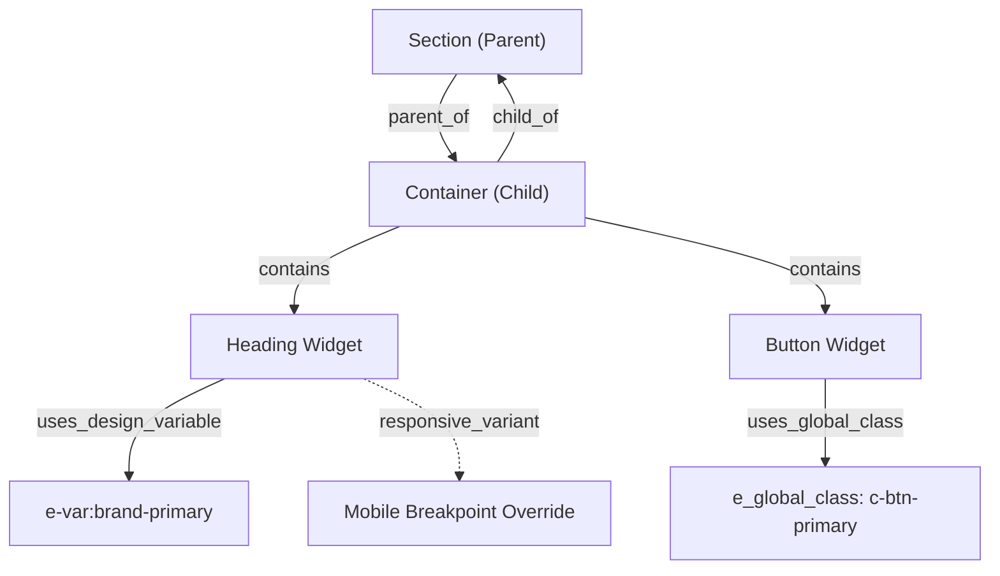

# Sitevero — Elementor Semantic Schema Specification

> **Document Status:** Specification Target (Documentation Only)  
> **Primary Source of Truth:** `docs/elementor-deep-capability-map.md`, `docs/07_elementor_specification.md`, `docs/06_capability_specification.md`  
> **Scope:** Defines the conceptual and JSON contract for translating raw Elementor AST trees (`_elementor_data`) into a clean, AI-understandable semantic representation without introducing new MCP tools or modifying production code.

---

## 1. Structural Representation Contract

Raw Elementor page data consists of deeply nested, verbose JSON dictionaries mixing layout, visual rendering settings, and metadata. The Semantic Schema normalizes this tree into a token-efficient structural representation.

### 1.1 Structural Node Schema
Every node in the semantic tree must expose the following core properties:

```typescript
interface SemanticNode {
  // Identification
  id: string;                      // 7-char alphanumeric ID (e.g., "7b8e1a2")
  element_type: string;            // Raw Elementor type (e.g., "container", "e-flexbox", "heading", "widget")
  widget_type?: string;            // If element_type === 'widget' (e.g., "heading", "text-editor")

  // Hierarchy & Geometry
  parent_id: string | null;        // ID of immediate parent container; null if root
  children_ids: string[];          // Ordered array of immediate child element IDs
  order_index: number;             // 0-indexed position within parent.children_ids
  nesting_depth: number;           // Depth level (0 for root elements, max safe depth = 8)

  // Engine & Boundary Context
  engine_context: {
    mode: 'v3' | 'v4_atomic';      // Engine context for this specific node
    is_root: boolean;              // True if direct child of document root
    is_inner: boolean;             // True if nested inside another container
    boundary_isolated: boolean;    // True if node represents a hybrid engine boundary
  };

  // Semantic & Stylistic Layers
  semantic?: SemanticClassification;
  styles?: StyleSemantics;
  relationships?: NodeRelationships;
}
```

---

## 2. Evidence-Based Semantic Classification

AI models require higher-level comprehension of layout elements to propose meaningful edits. Semantic roles are **inferred from empirical structural evidence**, never assumed. If an element does not meet strict evidence criteria, its role remains `null` or is assigned confidence `UNKNOWN`.

### 2.1 Role Definitions & Evidence Matrix

| Semantic Role | Required Evidence | Optional Evidence | Confidence | Incompatible Structures | Unknown / Fallback Handling |
|---|---|---|---|---|---|
| **page** | Document root array containing >= 1 root container. | Template type `'default'` or `'elementor_canvas'`. | **HIGH** | Single standalone widget not wrapped in a container. | Fallback to `UNKNOWN_DOCUMENT`. |
| **section** | Root container (`nesting_depth: 0`) or top-level V3 Section. | Contains padding >= 40px, has background color/image. | **HIGH** | Nested child widget (`nesting_depth > 1`). | Classified as generic `container`. |
| **container** | Element has `elType: "container"`, `"e-flexbox"`, `"e-grid"`, or `"e-div-block"`. | Flex layout properties (`flex_direction`, `justify_content`). | **HIGH** | Leaf widget (e.g. `button`, `heading`). | Retain generic `container` without sub-role. |
| **heading** | Widget type `'heading'` or atomic element `'e-heading'`. | Contains `settings.title` or `props.content.text`. | **HIGH** | Multi-paragraph text editor, image widget. | Fallback to raw widget type. |
| **paragraph** | Widget type `'text-editor'` or atomic element `'e-paragraph'`. | Contains `<p>` tags in `settings.editor`. | **HIGH** | Single short heading string, button link. | Fallback to raw widget type. |
| **image** | Widget type `'image'` or atomic element `'e-image'`. | Contains image URL, attachment ID, alt text. | **HIGH** | Background image property on container. | Fallback to raw widget type. |
| **button** | Widget type `'button'` or atomic element `'e-button'`. | Contains clickable URL link and text label. | **HIGH** | Static text block without anchor tag. | Fallback to raw widget type. |
| **navigation** | Container holding WP Menu widget or multiple sibling inline buttons/links. | Positioned inside header or at `nesting_depth: 0` top. | **MEDIUM** | Form input field, single isolated text editor. | Classified as generic `container`. |
| **card** | Container containing [Image + Heading + Paragraph + Button] with border/shadow/bg. | Equal column sizing in parent flex container. | **HIGH** | Empty container, root page section. | Classified as generic `container`. |
| **grid** | Container with CSS grid settings or flex wrap with >= 2 sibling cards/columns. | Sibling children share identical internal widget schemas. | **HIGH** | Single-column linear layout. | Classified as linear `container`. |
| **hero** | Section at `order_index: 0` with large min-height (>= 400px), H1 heading, and CTA button. | Dark background, text alignment centered, prominent CTA. | **HIGH** | Section positioned after index 0 or lacking H1/button. | Classified as standard `section`. |
| **footer** | Section at highest `order_index` or post template type `footer`. | Contains copyright text, legal links, social icons. | **HIGH** | Section at top of page, pricing section. | Classified as standard `section`. |
| **form** | Widget type `'form'` or atomic element `'e-form'`. | Contains input fields array, submit button actions. | **HIGH** | Static text block. | Fallback to raw widget type. |
| **list** | Widget type `'icon-list'` or container with repeated homogeneous item rows. | Prefix icons, repeated bullet items. | **MEDIUM** | Form input, image carousel. | Classified as generic `container`. |
| **repeated content** | Parent container whose children share identical widget sequence and styling. | Repeater field metadata or query loop settings. | **MEDIUM** | Heterogeneous mixed content. | Classified as generic `container`. |

---

## 3. Style Semantics Representation

Elementor styling must be normalized to distinguish **direct local overrides**, **reusable global classes**, and **design tokens**. Arbitrary CSS custom properties must never be confused with Elementor design variables.

### 3.1 Style Schema Contract

```typescript
interface StyleSemantics {
  // 1. Direct Local Overrides (Stored on node settings/props)
  local: {
    typography?: {
      font_family?: string;
      font_size?: { value: number; unit: 'px' | 'rem' | 'em' | 'vw' };
      font_weight?: string;
      line_height?: { value: number; unit: 'px' | 'em' | '-' };
      text_transform?: 'uppercase' | 'lowercase' | 'capitalize' | 'none';
    };
    spacing?: {
      padding?: Dimension4D;
      margin?: Dimension4D;
      gap?: { value: number; unit: 'px' | 'rem' };
    };
    colors?: {
      text?: string;               // Direct hex/rgba (e.g. "#38BDF8")
      background?: string;         // Direct hex/rgba (e.g. "#0B0F19")
      border?: string;             // Direct hex/rgba
    };
    borders?: {
      type?: 'solid' | 'dashed' | 'dotted' | 'none';
      width?: Dimension4D;
      radius?: Dimension4D;
    };
  };

  // 2. Elementor Global Classes (Elementor 4.x CPT e_global_class)
  global_classes: {
    attached_classes: string[];    // e.g. ["c-hero-title", "c-card-surface"]
    unresolved_classes: string[];  // Classes found in array but missing from CPT index
  };

  // 3. Elementor Design Variables & Tokens (Stored in Kit _elementor_global_variables)
  design_variables: {
    bound_tokens: Record<string, string>; // e.g. { "color": "e-var:dark-bg", "font": "e-var:font-primary" }
    unresolved_tokens: string[];          // Tokens referenced (e-var:*) but missing from active Kit
  };

  // 4. Arbitrary CSS Custom Properties (NOT Elementor tokens)
  arbitrary_css: {
    custom_properties: Record<string, string>; // e.g. { "--wp--preset--color--black": "#000" }
    raw_custom_css?: string;                  // Pro custom_css string (read-only)
  };

  // 5. Responsive Rules & Overrides
  responsive: {
    tablet_overrides: Record<string, any>;     // Keys suffixed with _tablet
    mobile_overrides: Record<string, any>;     // Keys suffixed with _mobile
    hidden_devices: ('desktop' | 'tablet' | 'mobile')[];
  };
}

interface Dimension4D {
  unit: 'px' | '%' | 'em' | 'rem';
  top: string;
  right: string;
  bottom: string;
  left: string;
  is_linked: boolean;
}
```

---

## 4. Relationship Model

Semantic reasoning requires explicit graph relationships between elements rather than naive tree traversal:



### 4.1 Defined Relationship Types
1. `parent_of`: A container directly encapsulating a child element.
2. `child_of`: An element positioned within a parent container.
3. `contains`: A container hosting one or more functional widgets.
4. `controls`: A container defining layout constraints (flex direction, justify-content, gap) for its children.
5. `references`: A widget targeting another element via anchor or trigger ID (e.g. popup trigger).
6. `uses_global_class`: Element attaches an `e_global_class` post record.
7. `uses_design_variable`: Element property binds an `e-var:{id}` design token from the active Kit.
8. `repeated_with`: Sibling elements sharing identical internal schema and styling (e.g., pricing cards).
9. `responsive_variant`: An element having dedicated overrides under tablet/mobile breakpoints.

---

## 5. Universal MCP AI Inspection Contract

The `sitevero_inspect` tool must deliver high-signal semantic metadata to the AI without flooding the context window with raw Elementor markup.

### 5.1 Inspection Request Contract (`sitevero_inspect`)
```json
{
  "type": "page",
  "id": 19,
  "options": {
    "view": "semantic",
    "include_styles": true,
    "include_tokens": true,
    "max_depth": 4
  }
}
```

### 5.2 Conceptual Semantic Inspection Response
```json
{
  "page_id": 19,
  "engine_mode": "v3",
  "active_kit_id": 8,
  "structure_summary": {
    "total_elements": 16,
    "max_depth": 3,
    "sections_count": 2,
    "widgets_count": 12
  },
  "semantic_tree": [
    {
      "id": "7b8e1a2",
      "element_type": "container",
      "semantic_role": "hero",
      "confidence": "HIGH",
      "order_index": 0,
      "nesting_depth": 0,
      "layout": {
        "display": "flex",
        "direction": "column",
        "align": "center",
        "justify": "center"
      },
      "tokens_used": ["e-var:dark_bg", "e-var:primary"],
      "children": [
        {
          "id": "2350616",
          "element_type": "widget",
          "widget_type": "heading",
          "semantic_role": "heading",
          "confidence": "HIGH",
          "content_preview": "Government · Defence · PSU Partner",
          "bound_tokens": {
            "title_color": "e-var:gold_accent"
          },
          "editable_fields": ["title", "title_color", "typography_font_size", "align"]
        },
        {
          "id": "8f1a9c3",
          "element_type": "widget",
          "widget_type": "button",
          "semantic_role": "button",
          "confidence": "HIGH",
          "content_preview": "Explore Services",
          "editable_fields": ["text", "link", "button_type", "background_color"]
        }
      ]
    }
  ]
}
```

---

## 6. Universal MCP AI Planning Contract

Before any mutation is proposed via `sitevero_execute`, the AI must construct a formal planning envelope to ensure predictability and safety.

### 6.1 Mutation Plan Specification
```typescript
interface AIExecutionPlan {
  // 1. Target Definition
  target: {
    post_id: number;
    element_id: string;
    expected_engine: 'v3' | 'v4_atomic';
  };

  // 2. State Transformation
  current_state: {
    settings_checksum: string;     // Hash of existing settings to detect concurrent edits
    summary: Record<string, any>;  // Current editable values
  };
  intended_state: {
    diff: Record<string, any>;     // Proposed settings/props to merge
  };

  // 3. Safety & Impact Analysis
  dependencies: {
    global_classes_affected: string[];
    design_tokens_affected: string[];
    child_elements_count: number;
  };
  risk_assessment: {
    level: 'LOW' | 'MEDIUM' | 'HIGH' | 'CRITICAL';
    reasons: string[];
  };

  // 4. Recovery Guarantees
  snapshot_requirement: true;      // Must always be true for mutating actions
  rollback_expectation: {
    target_postmeta: string[];     // e.g. ["_elementor_data", "_elementor_css"]
    guarantee: '100% Full Postmeta Restoration';
  };
}
```

---

## 7. Structural & Semantic Validation Rules

The Sitevero capability engine must enforce strict pre-execution validation before committing updates to `wp_postmeta._elementor_data`:

```
┌─────────────────────────────────────────────────────────────┐
│ 1. ID Uniqueness Check: Assert ID does not exist elsewhere  │
├─────────────────────────────────────────────────────────────┤
│ 2. Parent-Child Verification: Assert parent exists in tree  │
├─────────────────────────────────────────────────────────────┤
│ 3. Engine Boundary Check: Reject V3 keys on V4 atomic nodes │
├─────────────────────────────────────────────────────────────┤
│ 4. Control Whitelist Check: Assert setting exists in schema │
├─────────────────────────────────────────────────────────────┤
│ 5. Token Reference Check: Assert e-var:* exists in Kit      │
├─────────────────────────────────────────────────────────────┤
│ 6. Global Class Check: Assert class exists in e_global_class│
├─────────────────────────────────────────────────────────────┤
│ 7. Tree Integrity Assertion: Re-decode AST before commit    │
└─────────────────────────────────────────────────────────────┘
```

1. **Unique IDs:** Node ID must be unique across the entire document. Generating duplicate IDs causes immediate rejection.
2. **Valid Parent/Child References:** Children in `elements: []` must have their `parent_id` point strictly to the enclosing container.
3. **Engine Boundary Integrity:** Flat V3 controls (e.g. `typography_typography`) must NOT be merged into V4 atomic elements. V4 `props` must NOT be merged into V3 widgets.
4. **Valid Property Groups:** Modifications must belong to recognized property groups (Content, Layout, Spacing, Typography, Colors).
5. **Verified Global References:** Any design token reference (`e-var:*`) must exist in the active Kit's `_elementor_global_variables`. Any global class must exist as an active `e_global_class` post.
6. **Responsive Consistency:** Tablet overrides must not invert desktop layouts unless explicitly set; unit types must match across breakpoints.
7. **Zero Orphaned Elements:** Deleting or moving a node must explicitly account for all descendant nodes.

---

## 8. Semantic Confidence Model

To avoid unintended destructive modifications, Sitevero assigns confidence ratings to semantic classifications:

```
┌──────────────────────────────────────────────────────────────┐
│ HIGH: Full structural + widget evidence match. Safe to edit. │
├──────────────────────────────────────────────────────────────┤
│ MEDIUM: Partial structural match. Requires explicit diff.    │
├──────────────────────────────────────────────────────────────┤
│ LOW: Inferred from heuristic. Requires user confirmation.   │
├──────────────────────────────────────────────────────────────┤
│ UNKNOWN: No clear match. Treat strictly as raw widget.       │
└──────────────────────────────────────────────────────────────┘
```

- **`HIGH`:** Clear evidence (e.g. Widget type is `heading` and contains `settings.title`). Allowed to proceed with automated standard mutation plans.
- **`MEDIUM`:** Structural container inference (e.g. a `card` or `grid` identified by homogeneous children). The AI must specify exact element IDs rather than targeting "the card" generically.
- **`LOW`:** Ambiguous container (e.g. an unstyled container inferred as `hero` purely from top position). Destructive actions (delete, restructure) are **strictly blocked** under low confidence.
- **`UNKNOWN`:** Element has no discernible role beyond raw Elementor AST. The AI must interact with it strictly via its raw widget/container controls.

---

## 9. Universal MCP Mapping

Semantic intelligence is fully mediated through Sitevero's existing 4 Universal MCP Tools. **No Elementor-specific MCP tools are added.**

```
┌────────────────────────────────────────────────────────────────────────┐
│ sitevero_discover                                                      │
│ └── Returns: Elementor capability, V3/V4 engine, semantic schema ver.  │
├────────────────────────────────────────────────────────────────────────┤
│ sitevero_inspect                                                       │
│ └── Returns: Normalized semantic tree, inferred roles, editable schema │
├────────────────────────────────────────────────────────────────────────┤
│ sitevero_execute                                                       │
│ └── Accepts: Target ID, validated settings diff, pre-execution plan    │
├────────────────────────────────────────────────────────────────────────┤
│ sitevero_rollback                                                      │
│ └── Accepts: snapshot_uuid -> Restores exact prior database state      │
└────────────────────────────────────────────────────────────────────────┘
```

1. **`sitevero_discover`:**
   - Emits builder capability status:
     ```json
     {
       "capability": "builder",
       "provider": "elementor",
       "engine": "v3",
       "semantic_schema_version": "1.0",
       "supported_roles": ["hero", "navigation", "card", "grid", "footer"]
     }
     ```
2. **`sitevero_inspect`:**
   - Exposes normalized semantic representation instead of raw postmeta payloads.
3. **`sitevero_execute`:**
   - Executes targeted mutations using normalized property keys, automatically re-compiling to Elementor's native storage format (`_elementor_data`).
4. **`sitevero_rollback`:**
   - Provides universal safety by restoring database snapshots whenever verification fails or is requested.

---

## 10. Illustrative JSON Schema Examples

These examples are **illustrative documentation-level contracts** representing the target output format. They do not imply that the current MVP already produces these exact semantic outputs.

### 10.1 Hero Section Example
```json
{
  "id": "hero_7b8e1a",
  "element_type": "container",
  "semantic_role": "hero",
  "confidence": "HIGH",
  "layout": {
    "display": "flex",
    "direction": "column",
    "min_height": "500px",
    "background": {
      "type": "classic",
      "token": "e-var:dark_bg"
    }
  },
  "children": [
    {
      "id": "heading_23506",
      "element_type": "widget",
      "widget_type": "heading",
      "semantic_role": "heading",
      "confidence": "HIGH",
      "content": {
        "text": "Universal Infrastructure Solutions",
        "tag": "h1"
      }
    },
    {
      "id": "btn_8f1a9c",
      "element_type": "widget",
      "widget_type": "button",
      "semantic_role": "button",
      "confidence": "HIGH",
      "content": {
        "label": "Get Started",
        "url": "https://example.com/contact"
      }
    }
  ]
}
```

### 10.2 Navigation Example
```json
{
  "id": "nav_3c9d2e",
  "element_type": "container",
  "semantic_role": "navigation",
  "confidence": "HIGH",
  "layout": {
    "display": "flex",
    "direction": "row",
    "justify": "space-between",
    "align": "center"
  },
  "children": [
    {
      "id": "logo_1a2b3c",
      "element_type": "widget",
      "widget_type": "image",
      "semantic_role": "image",
      "confidence": "HIGH",
      "content": { "alt": "Site Logo" }
    },
    {
      "id": "menu_4d5e6f",
      "element_type": "widget",
      "widget_type": "nav-menu",
      "semantic_role": "navigation",
      "confidence": "HIGH",
      "content": { "menu_slug": "primary-nav" }
    }
  ]
}
```

### 10.3 Card Example
```json
{
  "id": "card_5a6b7c",
  "element_type": "container",
  "semantic_role": "card",
  "confidence": "HIGH",
  "layout": {
    "display": "flex",
    "direction": "column",
    "padding": "24px",
    "border_radius": "12px",
    "background": { "token": "e-var:surface" }
  },
  "children": [
    {
      "id": "card_img_8d",
      "element_type": "widget",
      "widget_type": "image",
      "semantic_role": "image",
      "confidence": "HIGH"
    },
    {
      "id": "card_h_9e",
      "element_type": "widget",
      "widget_type": "heading",
      "semantic_role": "heading",
      "confidence": "HIGH",
      "content": { "text": "Cloud Migration", "tag": "h3" }
    },
    {
      "id": "card_p_1f",
      "element_type": "widget",
      "widget_type": "text-editor",
      "semantic_role": "paragraph",
      "confidence": "HIGH",
      "content": { "text": "Enterprise cloud architectural migration with zero downtime." }
    }
  ]
}
```

### 10.4 Grid Example
```json
{
  "id": "grid_9f8e7d",
  "element_type": "container",
  "semantic_role": "grid",
  "confidence": "HIGH",
  "layout": {
    "display": "grid",
    "grid_columns": "repeat(3, 1fr)",
    "gap": "30px"
  },
  "children_ids": ["card_5a6b7c", "card_5a6b7d", "card_5a6b7e"]
}
```

### 10.5 Footer Example
```json
{
  "id": "footer_1b2c3d",
  "element_type": "container",
  "semantic_role": "footer",
  "confidence": "HIGH",
  "layout": {
    "display": "flex",
    "direction": "column",
    "padding": "60px 30px"
  },
  "children": [
    {
      "id": "footer_copyright_4e",
      "element_type": "widget",
      "widget_type": "text-editor",
      "semantic_role": "paragraph",
      "confidence": "HIGH",
      "content": { "text": "© 2026 Sitevero Inc. All rights reserved." }
    }
  ]
}
```

---

## 11. Preserved Unknowns

In strict alignment with `docs/elementor-deep-capability-map.md`, the following items remain unverified and must NOT be resolved prematurely:

1. **`atomic-collection-loop` Repeater Schema:** Data structure and repeater sub-field schema for `atomic-collection-loop` on populated dynamic archives remain **NOT VERIFIED**.
2. **Theme Builder Multi-Condition Serialization:** Exact serialization format of `_elementor_conditions` across complex taxonomy exclusion rules remains **NOT VERIFIED**.
3. **Elementor Core Internal MCP Abilities:** Elementor 4.2.2 experimental internal MCP abilities (`modules/mcp/abilities`) REST interface behavior remains **NOT VERIFIED**.
4. **Third-Party Builder Addons:** Behavior of third-party widget controls under Sitevero's tree normalizer remains **NOT VERIFIED**.

---

## 12. Implementation Boundaries

To ensure strict engineering governance, capabilities are partitioned into 4 distinct maturity tiers:

```
┌─────────────────────────────────────────────────────────────┐
│ 1. CURRENTLY IMPLEMENTED (Sitevero Phase 6 MVP)            │
│    - Version & Pro detection (FreeProDetector)              │
│    - Engine detection (V3, V4, Hybrid)                     │
│    - Basic tree normalization (Normalizer.php)              │
│    - Single widget settings mutation (by 7-char ID)         │
│    - Universal 4 tools integration                          │
│    - Database snapshot & atomic rollback                    │
├─────────────────────────────────────────────────────────────┤
│ 2. DOCUMENTED TARGET (This Specification)                   │
│    - Normalized SemanticNode schema                         │
│    - 15 evidence-based semantic roles with confidence levels│
│    - Decoupled StyleSemantics (local vs token vs class)     │
│    - AI planning & pre-execution validation contracts       │
│    - Structural relationship graph                          │
├─────────────────────────────────────────────────────────────┤
│ 3. NOT VERIFIED                                             │
│    - atomic-collection-loop repeater structures             │
│    - Theme builder conditions serialization                 │
│    - Elementor core MCP abilities integration               │
│    - Third-party builder addons (Croco, UAE)                │
├─────────────────────────────────────────────────────────────┤
│ 4. FUTURE (Phase 7+)                                        │
│    - Code implementation of Semantic Classifier             │
│    - Structural node creation, move, reorder, and duplicate │
│    - Global class & design token mutation                   │
│    - Scoped Kit settings mutation                           │
└─────────────────────────────────────────────────────────────┘
```

---

```
ELEMENTOR SEMANTIC SCHEMA SPECIFICATION COMPLETE
```
