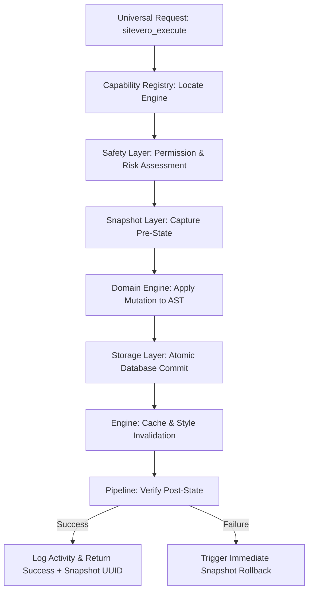
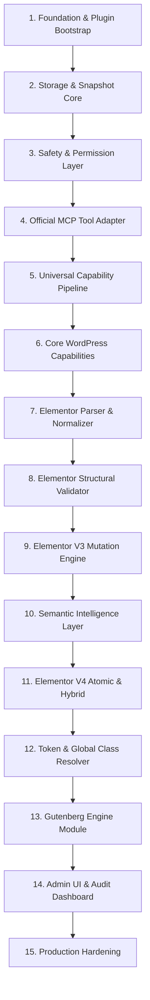

# Sitevero — Clean-Slate Scratch Architecture Specification

> **Document Status:** Clean-Slate Specification Target (Documentation Only)  
> **Primary Source of Truth:** `docs/00`–`15`, `docs/elementor-deep-capability-map.md`, `docs/elementor-semantic-schema-specification.md`  
> **Mode:** Architectural Design Only (Zero production code modifications, zero MCP tool expansions, zero MVP scope creep)

---

## Part 1 — Product Boundary

Sitevero is a **Universal WordPress AI MCP Plugin**. It bridges external Artificial Intelligence clients (via the Model Context Protocol) with internal WordPress systems, rendering engines, and builders.

### 1.1 What Sitevero IS
- **Single Installable WordPress Plugin:** Standard plugin containing the Sitevero Universal Capability Layer, builder modules, and safety controls.
- **MCP Capability Provider:** Plugs directly into the **Official WordPress MCP Adapter** (`automattic/mcp-wordpress-adapter`), providing domain capability logic.
- **Provider of Exactly 4 Universal MCP Tools:**
  1. `sitevero_discover`
  2. `sitevero_inspect`
  3. `sitevero_execute`
  4. `sitevero_rollback`
- **Builder-Agnostic Core:** Core routing, safety, permissions, snapshots, and activity logging are completely decoupled from specific builder AST formats.
- **Elementor Deep Engine (Primary Builder):** High-fidelity parser, normalizer, semantic classifier, and safe mutation pipeline supporting V3, V4 Atomic, and Hybrid modes.
- **Gutenberg Engine (Block Architecture):** Native block AST normalizer and safe block-attribute mutation pipeline.
- **Capability-Specific Snapshot & Rollback Engine:** Deterministic, state-reversing safety mechanism protecting against layout corruption.

### 1.2 What Sitevero IS NOT
- **NOT an MCP Server Implementation:** Sitevero does **not** manage low-level MCP JSON-RPC transports (SSE, stdio), HTTP server listeners, or authentication handshakes. That responsibility belongs strictly to the Official WordPress MCP Adapter.
- **NOT a Collection of Builder-Specific Tools:** There are no `elementor_create_widget`, `elementor_update_heading`, or `gutenberg_insert_block` MCP tools. All operations pass through the 4 universal tools.
- **NOT an Unrestricted Execution Engine:** Sitevero does **not** evaluate arbitrary PHP code (`eval`), execute arbitrary SQL, write arbitrary filesystem files, or inject unrestricted custom CSS/JS.
- **NOT a Lossy V3 ↔ V4 Converter:** Sitevero does **not** attempt automated or silent conversion between Elementor V3 containers and V4 atomic elements.
- **NOT a Universal State Rollback System:** Rollback does **not** claim full-database or whole-server restoration. Rollbacks are strictly targeted, capability-specific, and atomic at the post/option boundary.

---

## Part 2 — Clean Architecture (12 Conceptual Layers)

```
┌──────────────────────────────────────────────────────────────────────────┐
│                             EXTERNAL AI CLIENT                           │
│                      (Claude Desktop, Antigravity IDE)                   │
└────────────────────────────────────┬─────────────────────────────────────┘
                                     │ JSON-RPC (MCP)
┌────────────────────────────────────▼─────────────────────────────────────┐
│ LAYER 2: MCP INTEGRATION (Official WordPress MCP Adapter)                │
└────────────────────────────────────┬─────────────────────────────────────┘
                                     │ 4 Universal Tool Calls
┌────────────────────────────────────▼─────────────────────────────────────┐
│ LAYER 1: PLUGIN BOOTSTRAP (DI Container, Service Registration)           │
└────────────────────────────────────┬─────────────────────────────────────┘
                                     │
┌────────────────────────────────────▼─────────────────────────────────────┐
│ LAYER 3: UNIVERSAL CAPABILITY LAYER (Router, Registry, Capability API)    │
└──────────┬─────────────────────────┬─────────────────────────┬───────────┘
           │                         │                         │
┌──────────▼──────────────┐ ┌────────▼──────────────┐ ┌────────▼───────────┐
│ LAYER 7: SAFETY & PERMS │ │ LAYER 6: VALIDATION   │ │ LAYER 8: SNAPSHOT  │
│ (Capabilities, Risk)    │ │ (Schema, Whitelists)  │ │ & ROLLBACK (UUIDs) │
└──────────┬──────────────┘ └────────┬──────────────┘ └────────┬───────────┘
           │                         │                         │
┌──────────▼─────────────────────────▼─────────────────────────▼───────────┐
│ LAYER 4: DOMAIN / ENGINE LAYER (ElementorEngine, GutenbergEngine)        │
└────────────────────────────────────┬─────────────────────────────────────┘
                                     │
┌────────────────────────────────────▼─────────────────────────────────────┐
│ LAYER 5: SEMANTIC INTELLIGENCE LAYER (Classifier, Token Resolver, Graph) │
└────────────────────────────────────┬─────────────────────────────────────┘
                                     │
┌────────────────────────────────────▼─────────────────────────────────────┐
│ LAYER 9: STORAGE LAYER (wp_postmeta, wp_options, Atomic Post Writes)     │
└──────────┬───────────────────────────────────────────────────┬───────────┘
           │                                                   │
┌──────────▼──────────────┐                         ┌──────────▼───────────┐
│ LAYER 10: AUDIT & LOG   │                         │ LAYER 11: ADMIN UI   │
│ (Activity, Snapshots)   │                         │ (Dashboard, Diff View│
└─────────────────────────┘                         └──────────────────────┘
┌──────────────────────────────────────────────────────────────────────────┐
│ LAYER 12: TESTING LAYER (Unit, Integration, Runtime, AI E2E)             │
└──────────────────────────────────────────────────────────────────────────┘
```

### Layer Details & Boundaries

#### Layer 1: Plugin Bootstrap
- **Responsibility:** Plugin lifecycle, dependency verification, dependency injection container, service initialization.
- **Owns:** Hook wiring (`plugins_loaded`, `init`), version checks (PHP >= 7.4, WP >= 6.0), service provider bootstrapper.
- **Must NOT Own:** MCP tool registration, business logic, AST parsing.
- **Dependencies:** WordPress core hooks.
- **Public Interfaces:** `Sitevero\Plugin::instance()`, `Sitevero\Plugin::get_service(string $id)`.
- **Failure Boundaries:** Incompatible PHP/WP version halts execution gracefully with admin notice; plugin deactivates cleanly.

#### Layer 2: MCP Integration
- **Responsibility:** Adapting the 4 Universal Tools to the Official WordPress MCP Adapter schema.
- **Owns:** Registration hooks into the official adapter, MCP tool parameter schemas, response formatting to MCP standard.
- **Must NOT Own:** MCP transport management, capability routing, builder mutation.
- **Dependencies:** Official WordPress MCP Adapter (`Automattic\WordPress\MCP\Adapter`), Layer 3 (Universal Capability Layer).
- **Public Interfaces:** `Sitevero\MCP\ToolRegistrar::register_tools()`.
- **Failure Boundaries:** If the official adapter is absent or inactive, Sitevero logs an administrative warning; web admin and REST endpoints remain intact.

#### Layer 3: Universal Capability Layer
- **Responsibility:** Central mediator between universal MCP tool invocations and specific capability engines.
- **Owns:** Capability Registry, routing logic, execution pipeline coordination (Inspect -> Validate -> Snapshot -> Execute -> Verify).
- **Must NOT Own:** Builder-specific AST manipulation, low-level SQL/database queries.
- **Dependencies:** Layer 4 (Engines), Layer 6 (Validation), Layer 7 (Safety), Layer 8 (Snapshots).
- **Public Interfaces:** `CapabilityRegistryInterface`, `CapabilityRouterInterface`, `UniversalExecutionPipeline`.
- **Failure Boundaries:** Unregistered capability or unknown target type returns a structured `UNSUPPORTED_CAPABILITY` error.

#### Layer 4: Domain / Engine Layer
- **Responsibility:** Concrete domain modules representing builders and WordPress systems (`ElementorModule`, `GutenbergModule`, `CorePostModule`).
- **Owns:** Engine detection, raw tree extraction, builder-specific AST mutation, and cache invalidation.
- **Must NOT Own:** MCP serialization, user permissions validation, universal rollback coordination.
- **Dependencies:** Layer 5 (Semantic Layer), Layer 6 (Validation), Layer 9 (Storage).
- **Public Interfaces:** `BuilderEngineInterface` (`read()`, `inspect()`, `mutate()`, `verify()`).
- **Failure Boundaries:** Malformed builder data returns `INVALID_AST_STRUCTURE`; never triggers WordPress fatal errors.

#### Layer 5: Semantic Intelligence Layer
- **Responsibility:** Translates raw AST trees into normalized semantic models and relationship graphs for AI comprehension.
- **Owns:** Semantic role inference (`hero`, `card`, `grid`, etc.), style token resolution (`e-var:*`), global class indexing (`e_global_class`).
- **Must NOT Own:** Direct database writes, execution permissions, raw mutation.
- **Dependencies:** Layer 4 (Domain AST output).
- **Public Interfaces:** `SemanticClassifierInterface`, `TokenResolverInterface`, `RelationshipGraphBuilder`.
- **Failure Boundaries:** Unrecognized structure defaults gracefully to confidence `UNKNOWN`; never guesses mutations.

#### Layer 6: Validation Layer
- **Responsibility:** Structural, semantic, and safety validation of all proposed actions prior to execution.
- **Owns:** JSON schema validators, control whitelists, engine boundary checkers, ID uniqueness verifiers.
- **Must NOT Own:** Database snapshot capture, mutation execution.
- **Dependencies:** Layer 4 schemas, Layer 5 models.
- **Public Interfaces:** `PreExecutionValidatorInterface::validate(ActionProposal $proposal): ValidationResult`.
- **Failure Boundaries:** Any validation failure halts the pipeline immediately with specific error codes.

#### Layer 7: Safety & Permission Layer
- **Responsibility:** Access control, capability checks, risk categorization, and human-in-the-loop confirmation gates.
- **Owns:** WordPress capability mapping (`edit_posts`, `manage_options`), risk tiering (`LOW`, `MEDIUM`, `HIGH`, `CRITICAL`), confirmation requirement enforcement.
- **Must NOT Own:** Rollback execution, AST diffing.
- **Dependencies:** WordPress Current User API, Sitevero Settings.
- **Public Interfaces:** `SecurityPolicyInterface::check_permission()`, `RiskClassifierInterface::assess_risk()`.
- **Failure Boundaries:** Unauthorized actions return `PERMISSION_DENIED`; unconfirmed high-risk actions return `CONFIRMATION_REQUIRED`.

#### Layer 8: Snapshot & Rollback Layer
- **Responsibility:** Pre-execution state capture and deterministic restoration.
- **Owns:** Snapshot creation, UUID generation, checksum hashing, postmeta snapshot storage, atomic restoration routines.
- **Must NOT Own:** Long-term database backups, site-wide database exports, activity log rendering.
- **Dependencies:** Layer 9 (Storage Layer).
- **Public Interfaces:** `SnapshotManagerInterface::capture()`, `RollbackManagerInterface::restore(string $uuid)`.
- **Failure Boundaries:** If snapshot capture fails or payload exceeds 2MB, mutation execution is **aborted immediately**.

#### Layer 9: Storage Layer
- **Responsibility:** Low-level WordPress database abstractions for post meta, options, and snapshot storage.
- **Owns:** Slashing/unslashing protocols (`wp_slash`, `wp_unslash`), transactional postmeta updates, options cache invalidation.
- **Must NOT Own:** Business logic, AST serialization rules.
- **Dependencies:** WordPress Database API (`$wpdb`, `get_post_meta`, `update_post_meta`).
- **Public Interfaces:** `MetaStorageInterface`, `SnapshotStorageInterface`.
- **Failure Boundaries:** DB write failures roll back in-flight transactions and report `STORAGE_WRITE_FAILURE`.

#### Layer 10: Activity & Audit Layer
- **Responsibility:** Immutable recording of all MCP tool invocations, AI execution plans, snapshots, and rollbacks.
- **Owns:** Activity log table/storage, log rotation (30-day / 50-snapshot retention), audit query APIs.
- **Must NOT Own:** Snapshot restoration, execution authorization.
- **Dependencies:** Layer 8 (Snapshots), Layer 9 (Storage).
- **Public Interfaces:** `AuditLoggerInterface::log_activity(ActivityEvent $event)`.
- **Failure Boundaries:** Logging errors fail silently to disk fallback; never crash user mutations.

#### Layer 11: Admin Layer
- **Responsibility:** WordPress administrative UI, settings management, and activity/diff review.
- **Owns:** Admin menu registration, visual diff viewer, snapshot rollback buttons, health dashboard.
- **Must NOT Own:** MCP JSON-RPC handlers, mutation pipeline.
- **Dependencies:** Layer 8 (Snapshots), Layer 10 (Audit Logs).
- **Public Interfaces:** `AdminController::render_dashboard()`.
- **Failure Boundaries:** Admin UI errors do not impact MCP tool availability or background processing.

#### Layer 12: Testing Layer
- **Responsibility:** Automated verification suite covering all layers across multiple environments.
- **Owns:** Unit tests, integration tests, WordPress runtime fixtures, MCP mock clients, staging verification scripts.
- **Must NOT Own:** Production plugin code.
- **Dependencies:** All layers.
- **Public Interfaces:** PHPUnit suites, CLI verification harnesses.
- **Failure Boundaries:** Test failures block releases; test fixtures never load in production environments.

---

## Part 3 — Core Pipeline (Canonical AI Execution Lifecycle)

Every mutation follows an immutable 8-stage pipeline:

```
[1. DISCOVER] ──► Inspects environment, versions, active builders, capabilities.
       │
[2. INSPECT] ───► Reads raw AST, normalizes node hierarchy, extracts geometry.
       │
[3. UNDERSTAND] ─► Classifies semantic roles, resolves tokens, builds relationship graph.
       │
[4. PLAN] ──────► Constructs mutation envelope: target, diff, risk, dependencies.
       │
[5. CONFIRM] ───► Evaluates risk level; halts for confirmation if HIGH or CRITICAL.
       │
[6. EXECUTE] ───► Captures snapshot, applies AST mutation, writes postmeta atomically.
       │
[7. VERIFY] ────► Re-inspects mutated target; asserts target state matches intended state.
       │
[8. ROLLBACK] ──► Automatically triggered if verification fails or user requests undo.
```

### Stage Ownership

| Stage | Owning Layer | Inputs | Outputs | Safety Precondition |
|---|---|---|---|---|
| **1. DISCOVER** | Universal Capability Layer | Discovery query | Registered capability list, engine versions | None (Read-only) |
| **2. INSPECT** | Domain / Engine Layer | Target entity (post ID, element ID) | Normalized element tree, raw geometry | Entity exists & readable |
| **3. UNDERSTAND** | Semantic Intelligence Layer | Normalized element tree | `SemanticNode` hierarchy, style tokens, graph | Valid normalized AST |
| **4. PLAN** | External AI Client via Schema | Semantic tree, user goal | `AIExecutionPlan` (diff, dependencies, risk) | Clear semantic context |
| **5. CONFIRM** | Safety & Permission Layer | `AIExecutionPlan`, User caps | Confirmation status (`APPROVED` or `BLOCKED`)| User permission verified |
| **6. EXECUTE** | Universal Pipeline & Engine | Approved Plan | Execution Result, Snapshot UUID | **Pre-execution Snapshot Required** |
| **7. VERIFY** | Domain Engine & Pipeline | Target ID, expected state | Verification status (`MATCH` or `MISMATCH`)| Execution completed |
| **8. ROLLBACK** | Snapshot & Rollback Layer | Snapshot UUID | Restored database state, cache cleared | Snapshot exists & valid |

---

## Part 4 — Universal Capability Model

To support WordPress Core, Elementor, Gutenberg, and future engines symmetrically, Sitevero establishes a generic capability contract.

### 4.1 Capability Specification
```typescript
interface Capability {
  id: string;                      // e.g. "builder.elementor", "core.post", "builder.gutenberg"
  category: 'builder' | 'content' | 'media' | 'settings';
  provider: string;                // e.g. "elementor", "wordpress_core", "gutenberg"
  supported_operations: OperationType[];
  engine_version: string;
  is_available: boolean;
}

type OperationType = 
  | 'READ' | 'INSPECT' | 'CREATE' | 'UPDATE' 
  | 'MOVE' | 'DUPLICATE' | 'DELETE' | 'REORDER' 
  | 'RELATE' | 'ROLLBACK';
```

### 4.2 Generic Capability Lifecycle



---

## Part 5 — Elementor Engine Architecture

Elementor is encapsulated as a fully isolated capability engine inside `inc/Engines/Elementor/`.

```
┌────────────────────────────────────────────────────────────────────────┐
│                        RAW ELEMENTOR DATA (_elementor_data)            │
└───────────────────────────────────┬────────────────────────────────────┘
                                    │ json_decode / wp_unslash
┌───────────────────────────────────▼────────────────────────────────────┐
│ 1. PARSER: Lexical validation & node extraction                        │
└───────────────────────────────────┬────────────────────────────────────┘
                                    │ Raw Nodes
┌───────────────────────────────────▼────────────────────────────────────┐
│ 2. NORMALIZED TREE: Hierarchy, IDs, parent/child indices, depths       │
└───────────────────────────────────┬────────────────────────────────────┘
                                    │ Normalized Nodes
┌───────────────────────────────────▼────────────────────────────────────┐
│ 3. STRUCTURAL VALIDATOR: AST integrity, no duplicate IDs               │
└───────────────────────────────────┬────────────────────────────────────┘
                                    │ Validated AST
┌───────────────────────────────────▼────────────────────────────────────┐
│ 4. SEMANTIC CLASSIFIER: Evidence-based role tagging (Hero, Card, Grid) │
└───────────────────────────────────┬────────────────────────────────────┘
                                    │ Semantic Nodes
┌───────────────────────────────────▼────────────────────────────────────┐
│ 5. STYLE & TOKEN RESOLVER: e-var:* design tokens & e_global_class      │
└───────────────────────────────────┬────────────────────────────────────┘
                                    │ Decorated Nodes
┌───────────────────────────────────▼────────────────────────────────────┐
│ 6. RELATIONSHIP GRAPH: parent_of, contains, uses_token, repeated_with  │
└───────────────────────────────────┬────────────────────────────────────┘
                                    │ Semantic Graph
┌───────────────────────────────────▼────────────────────────────────────┐
│ 7. PLANNER & DIFF ENGINE: Target isolation, mutation envelope          │
└───────────────────────────────────┬────────────────────────────────────┘
                                    │ Execution Plan
┌───────────────────────────────────▼────────────────────────────────────┐
│ 8. MUTATION ENGINE: In-place AST merge, ID generation, flex updates    │
└───────────────────────────────────┬────────────────────────────────────┘
                                    │ Mutated AST
┌───────────────────────────────────▼────────────────────────────────────┐
│ 9. STORAGE & CACHE INVALIDATOR: Commit postmeta, flush _elementor_css   │
└───────────────────────────────────┬────────────────────────────────────┘
                                    │ Mutated Target
┌───────────────────────────────────▼────────────────────────────────────┐
│ 10. VERIFIER: Assert new values rendered properly                      │
└───────────────────────────────────┬────────────────────────────────────┘
                                    │
                         [Pass] ────┴──── [Fail: Trigger Rollback]
```

### Component Boundaries
- **Parser does NOT mutate:** Read-only AST extraction.
- **Normalizer does NOT infer semantics:** Only normalizes tree geometry (order, depth, parent/child).
- **Classifier does NOT write to database:** Only attaches role tags and confidence ratings.
- **Mutation Engine does NOT classify:** Strictly applies validated diffs to raw AST nodes.

---

## Part 6 — Elementor Semantic Model

Preserves the exact specification defined in `docs/elementor-semantic-schema-specification.md`:

```typescript
interface SemanticNode {
  id: string;                      // 7-character alphanumeric string
  element_type: string;            // "container" | "e-flexbox" | "e-grid" | "e-div-block" | "widget"
  widget_type?: string;            // "heading" | "button" | "text-editor" | "image"
  parent_id: string | null;        // Enclosing container ID
  children_ids: string[];          // Child elements
  order_index: number;             // Position index within parent
  nesting_depth: number;           // Depth from document root (0 to 8)
  engine_context: {
    mode: 'v3' | 'v4_atomic';
    is_root: boolean;
    is_inner: boolean;
    boundary_isolated: boolean;
  };
  semantic?: {
    role: 'hero' | 'navigation' | 'card' | 'grid' | 'footer' | 'heading' | 'button' | 'paragraph' | 'image' | 'form';
    confidence: 'HIGH' | 'MEDIUM' | 'LOW' | 'UNKNOWN';
    matched_evidence: string[];
  };
  styles?: StyleSemantics;
  relationships?: NodeRelationships;
}
```

### Confidence Rules:
- **`HIGH`:** Complete structural and widget evidence match. Safe for automated mutation.
- **`MEDIUM`:** Structural container inference (e.g. repeated card sequence). Must specify exact element IDs.
- **`LOW`:** Position-based heuristic inference. Destructive actions **strictly prohibited**.
- **`UNKNOWN`:** No pattern match. Exposed strictly as raw Elementor widget; zero guessing.

---

## Part 7 — Elementor Version Isolation

Elementor supports multiple architectural generations that must coexist without cross-contamination.

```
┌─────────────────────────────────────────────────────────────┐
│                    PAGE AST ENGINE DETECTOR                 │
└──────────────────────────────┬──────────────────────────────┘
                               │
         ┌─────────────────────┼─────────────────────┐
         │ Pure V3             │ Pure V4             │ Mixed Hybrid
┌────────▼─────────┐  ┌────────▼─────────┐  ┌────────▼─────────┐
│ V3 Engine Branch │  │ V4 Engine Branch │  │ Hybrid Sub-Tree  │
│ Container / Sec  │  │ Atomic Widgets   │  │ Isolated Branches│
│ Flat settings    │  │ props & classes  │  │ Strict Boundaries│
└──────────────────┘  └──────────────────┘  └──────────────────┘
```

### Version Boundaries:
1. **Engine Separation:**
   - V3 nodes use flat `settings: { ... }`.
   - V4 nodes use nested `props: { ... }` and `classes: string[]`.
2. **Hybrid Coexistence:**
   - A V3 container may host a V4 container as a child, but the child boundary is marked `boundary_isolated: true`.
   - The mutation engine rejects any diff containing V3 keys targeting a V4 atomic element.
3. **No Automatic Conversion:**
   - Sitevero never converts V3 sections into V4 flexboxes or vice versa.
4. **Future-Proofing (Third Engine Architecture):**
   - Adding a future Elementor representation (e.g., V5 Components) requires only implementing a `V5EngineBranch` implementing `BuilderEngineBranchInterface`; the Semantic Model remains untouched.

---

## Part 8 — Mutation Architecture

The Mutation Engine operates downstream from the Semantic Layer, handling concrete AST transformations.

| Operation | Target | Preconditions | Validation Rule | Risk Tier | Snapshot Req. | Rollback Behavior |
|---|---|---|---|---|---|---|
| **READ** | `post_id` | Post exists | Read capability | Minimal | No | N/A |
| **INSPECT** | `post_id` + `element_id` | Post has `_elementor_data` | Valid ID format | Minimal | No | N/A |
| **UPDATE** | `element_id` | Element exists in tree | Whitelisted controls, valid types | Low | **YES** | 100% Postmeta restore |
| **CREATE** | `parent_id` + `index` | Parent container exists | Generate strictly unique 7-char ID | Medium | **YES** | 100% Postmeta restore |
| **MOVE** | `element_id` + `target_parent` | Source and target exist | Same engine mode or valid boundary | High | **YES** | 100% Postmeta restore |
| **DUPLICATE** | `element_id` | Element exists in tree | Regenerate all descendant IDs | Medium | **YES** | 100% Postmeta restore |
| **DELETE** | `element_id` | Element exists in tree | Child count verified; recursive flag | High | **YES** | 100% Postmeta restore |
| **REORDER** | `parent_id` + `order[]` | Parent container exists | All IDs match existing children | High | **YES** | 100% Postmeta restore |
| **RELATE** | `element_id` + `class` | Element & class exist | Class registered in `e_global_class` | Medium | **YES** | 100% Postmeta restore |
| **ROLLBACK** | `snapshot_uuid` | Snapshot file/record exists | Checksum integrity verified | Low | No | Restores exact prior database state |

---

## Part 9 — Safety & Permission Architecture

Safety is enforced via a non-bypassable pipeline:

```
Request ──► 1. Permission Check (WP User Caps)
                 │
            2. Risk Classification (LOW / MED / HIGH / CRITICAL)
                 │
            3. Confirmation Gate (Human-in-the-Loop if HIGH/CRITICAL)
                 │
            4. Pre-Execution Snapshot (Atomic Capture)
                 │
            5. Execution (In-Place AST Mutation)
                 │
            6. Post-Verification (State Assertion)
                 │
            [Fail] ──► 7. Atomic Rollback
```

### Prohibited Actions:
- **NO Arbitrary Code:** No evaluation of PHP strings, dynamic function calls, or file writes.
- **NO Raw SQL:** All operations use WordPress data APIs with prepared statements.
- **NO Unfiltered HTML / JS:** Script tags, event attributes (`onload`, `onclick`) are stripped by `content-sanitizer`.
- **NO Unrestricted CSS:** Arbitrary custom CSS property strings are rejected unless validated against property whitelists.

---

## 10. Snapshot & Rollback Architecture

Rollbacks in Sitevero are **capability-specific and deterministic**, not full database snapshots.

### 10.1 Snapshot Identity & Storage
- **Identity:** UUIDv4 string (e.g. `c7a19e2b-8f3a-4a21-9d1e-5f8a2b3c4d5e`).
- **Storage Location:** Stored in custom table `wp_sitevero_snapshots` with JSON backup in `wp-content/uploads/sitevero/snapshots/`.
- **Payload Limit:** Maximum **2 MB** per snapshot. If an AST exceeds 2MB, snapshot capture fails with `SNAPSHOT_PAYLOAD_EXCEEDED` and the mutation aborts.
- **Retention Policy:** Kept for **30 days** or maximum **50 snapshots per post ID**. Older snapshots are pruned automatically via cron.

### 10.2 Snapshot State Schema
```typescript
interface EntitySnapshot {
  uuid: string;
  post_id: number;
  capability_id: string;
  created_at: string;
  user_id: number;
  state_checksum: string;          // SHA-256 hash of captured state
  captured_data: {
    post_record: {
      post_title: string;
      post_content: string;
      post_excerpt: string;
      post_status: string;
    };
    postmeta: {
      _elementor_data?: string;
      _elementor_page_settings?: string;
      _elementor_edit_mode?: string;
      _elementor_template_type?: string;
      _elementor_version?: string;
      _elementor_css?: string;
    };
  };
  restoration_count: number;
  status: 'ACTIVE' | 'RESTORED' | 'NOT_RESTORABLE';
}
```

---

## Part 11 — Official WordPress MCP Adapter Boundary

Sitevero maintains a strict separation of concerns with the **Official WordPress MCP Adapter**:

```
┌────────────────────────────────────────────────────────────────────────┐
│               OFFICIAL WORDPRESS MCP ADAPTER OWNS:                     │
│  - MCP Protocol & JSON-RPC 2.0 transport handling                      │
│  - Transport channels (HTTP SSE, Stdio, WebSockets)                    │
│  - Authentication & Application Password verification                  │
│  - MCP Client registration & handshake                                 │
└───────────────────────────────────┬────────────────────────────────────┘
                                    │ Invokes registered tool callback
┌───────────────────────────────────▼────────────────────────────────────┐
│                      SITEVERO PLUGIN OWNS:                             │
│  - Registration of exactly 4 Universal MCP Tools                       │
│  - Capability resolution & routing                                     │
│  - Builder AST parsing, normalization, and mutation                    │
│  - Semantic classification and token resolution                        │
│  - Pre-execution validation & risk assessment                          │
│  - Atomic snapshot capture and rollback restoration                    │
│  - Activity logging and visual diffing                                 │
└────────────────────────────────────────────────────────────────────────┘
```

Sitevero **never** re-implements JSON-RPC parsing or transport listeners.

---

## Part 12 — Architecture & Data Flow Diagrams

### Flow A: Discover
```
External Client ──► sitevero_discover()
                        │
                        ▼
             MCP Tool Registrar (Layer 2)
                        │
                        ▼
         Universal Capability Registry (Layer 3)
                        │
             Queries Installed Engines:
             - Core Post Capability
             - Elementor Engine (v3/v4 status, experiments, active kit)
             - Gutenberg Engine (block status)
                        │
                        ▼
             Consolidates Discovery Payload
                        │
                        ▼
External Client ◄── Returns Capability Summary
```

### Flow B: Inspect (Structural)
```
External Client ──► sitevero_inspect(post_id: 19)
                        │
                        ▼
            Capability Router -> Elementor Engine
                        │
                        ▼
         Read _elementor_data from wp_postmeta
                        │
                        ▼
         Tree Parser -> Normalizer (Layer 4)
                        │
                        ▼
External Client ◄── Returns Normalized AST (Counts, Depths, IDs)
```

### Flow C: Semantic Inspection
```
External Client ──► sitevero_inspect(post_id: 19, view: "semantic")
                        │
                        ▼
            Tree Parser -> Normalizer (Layer 4)
                        │
                        ▼
       Semantic Classifier -> Token Resolver (Layer 5)
       - Infers Hero, Card, Grid roles with confidence
       - Resolves e-var:* tokens and e_global_class
                        │
                        ▼
External Client ◄── Returns Semantic Tree (Clean JSON, Editable Fields)
```

### Flow D: Plan
```
External Client ──► Evaluates Semantic Tree
                        │
                        ▼
              Constructs AIExecutionPlan:
              - Target: post #19, element "2350616"
              - Current hash / Intended diff
              - Risk level & dependencies
                        │
                        ▼
External Client ◄── Internal AI Planning complete (Ready to execute)
```

### Flow E: Execute
```
External Client ──► sitevero_execute(plan)
                        │
                        ▼
             1. Check User Capabilities (Layer 7)
                        │
             2. Validate Schema & Boundaries (Layer 6)
                        │
             3. Evaluate Risk & Human Confirmation (Layer 7)
                        │
             4. Capture Pre-Execution Snapshot (Layer 8)
                        │
             5. Apply Diff to AST in Memory (Layer 4)
                        │
             6. Commit Postmeta Atomically (Layer 9)
                        │
             7. Invalidate _elementor_css Cache (Layer 4)
                        │
             8. Verify Post-State (Layer 4/3)
                        │
             9. Log Activity Event (Layer 10)
                        │
                        ▼
External Client ◄── Returns Success + Snapshot UUID
```

### Flow F: Verify
```
Pipeline Engine ──► Reads Target Element Post-Mutation
                        │
                        ▼
             Compares Actual State with Intended State
                        │
         ┌──────────────┴──────────────┐
      [MATCH]                       [MISMATCH]
         │                             │
Pipeline Continues           Trigger Rollback(uuid)
Return SUCCESS               Return VERIFICATION_FAILED
```

### Flow G: Rollback
```
External Client ──► sitevero_rollback(snapshot_uuid)
                        │
                        ▼
            Rollback Manager (Layer 8)
                        │
            Locates Snapshot by UUID in Storage
                        │
            Verifies SHA-256 Checksum Integrity
                        │
            Overwrites wp_postmeta & wp_posts Atomically
                        │
            Deletes _elementor_css to Force Recompile
                        │
            Logs Rollback Event in Audit Trail
                        │
                        ▼
External Client ◄── Returns Rollback Confirmation
```

---

## Part 13 — Error Model

Sitevero enforces a standardized error envelope:

```typescript
interface SiteveroErrorResponse {
  success: false;
  error: {
    code: SiteveroErrorCode;
    message: string;
    details?: Record<string, any>;
    remediation?: string;
  };
}
```

### Error Code Taxonomy

| Error Code | Category | Cause | Remediation Action |
|---|---|---|---|
| `INVALID_REQUEST` | Client | Malformed JSON parameters or missing required keys | Correct parameter payload schema |
| `PERMISSION_DENIED` | Safety | User lacks WordPress capability (`edit_posts`) | Re-authenticate with authorized credentials |
| `UNSUPPORTED_CAPABILITY` | Engine | Target builder or entity not installed/active | Enable target plugin or use core capability |
| `UNSUPPORTED_STRUCTURE` | Engine | Element AST uses deprecated or unrecognized syntax | Inspect as raw unknown node |
| `VALIDATION_FAILURE` | Validation | Proposed diff violates control whitelist or ID rules | Align diff with element control schema |
| `CONFIRMATION_REQUIRED` | Safety | Operation classified as HIGH or CRITICAL risk | Prompt user for explicit human approval |
| `SNAPSHOT_FAILURE` | Safety | Pre-execution snapshot capture failed | Abort execution; inspect storage permissions |
| `SNAPSHOT_PAYLOAD_EXCEEDED`| Safety | Page AST exceeds 2 MB snapshot threshold | Reduce page size or isolate sub-tree edit |
| `EXECUTION_FAILURE` | Storage | Database write failed during postmeta commit | Inspect MySQL connection and disk space |
| `VERIFICATION_FAILURE` | Pipeline | Post-mutation state does not match intended diff | Automatic rollback triggered |
| `ROLLBACK_FAILURE` | Safety | Snapshot checksum mismatch or corrupted record | Manual administrative intervention required |
| `NOT_RESTORABLE` | Safety | Snapshot expired or target post deleted from database | Restore from external database backup |

---

## Part 14 — Extensibility Architecture

Adding future capabilities (e.g. Gutenberg block builder, WooCommerce products) requires **zero changes to the 4 universal MCP tools**:

```
┌─────────────────────────────────────────────────────────────┐
│                 UNIVERSAL CAPABILITY REGISTRY               │
└──────┬───────────────────────┬───────────────────────┬──────┘
       │                       │                       │
┌──────▼──────┐         ┌──────▼──────┐         ┌──────▼──────┐
│ Elementor   │         │ Gutenberg   │         │ Future:     │
│ Capability  │         │ Capability  │         │ WooCommerce │
│ Engine      │         │ Engine      │         │ Capability  │
└─────────────┘         └─────────────┘         └─────────────┘
```

### Module Registration Contract:
A new module implements `CapabilityModuleInterface`:
```php
interface CapabilityModuleInterface {
    public function get_capability_id(): string;
    public function is_available(): bool;
    public function get_discovery_metadata(): array;
    public function get_inspector(): InspectorInterface;
    public function get_mutator(): MutatorInterface;
}
```
The universal layer queries the registry dynamically; tools never change.

---

## Part 15 — Clean Scratch Directory Architecture

```
sitevero/
├── sitevero.php                        # Plugin entry file & bootstrap
├── composer.json                       # PSR-4 autoloading & dependencies
├── inc/
│   ├── Plugin.php                      # Main service container & lifecycle
│   │
│   ├── MCP/                            # Layer 2: MCP Integration
│   │   ├── ToolRegistrar.php           # Registers the 4 universal tools
│   │   ├── Handlers/                   # MCP request handlers
│   │   │   ├── DiscoverHandler.php
│   │   │   ├── InspectHandler.php
│   │   │   ├── ExecuteHandler.php
│   │   │   └── RollbackHandler.php
│   │   └── Schemas/                    # Tool parameter schemas
│   │
│   ├── Capabilities/                   # Layer 3: Universal Capability Layer
│   │   ├── CapabilityRegistry.php      # Central capability registry
│   │   ├── CapabilityRouter.php        # Resolves target to engine
│   │   └── Pipeline/                   # Canonical execution pipeline
│   │       ├── ExecutionPipeline.php
│   │       └── PipelineContext.php
│   │
│   ├── Engines/                        # Layer 4: Domain Engines
│   │   ├── Core/                       # WordPress standard posts/pages
│   │   │   └── PostEngine.php
│   │   ├── Gutenberg/                  # Block editor engine
│   │   │   └── GutenbergEngine.php
│   │   └── Elementor/                  # Elementor engine module
│   │       ├── ElementorEngine.php     # Main engine facade
│   │       ├── Parser.php              # Lexical AST parser
│   │       ├── Normalizer.php          # Tree normalizer (IDs, depth)
│   │       ├── FreeProDetector.php     # License & pro feature detection
│   │       ├── Branches/               # Version-isolated branches
│   │       │   ├── V3Branch.php        # V3 Containers & Sections
│   │       │   ├── V4AtomicBranch.php  # V4 Atomic Elements
│   │       │   └── HybridBranch.php    # Hybrid boundary isolation
│   │       └── Mutation/               # AST mutators
│   │           ├── SettingsMutator.php
│   │           └── TreeMutator.php
│   │
│   ├── Semantic/                       # Layer 5: Semantic Intelligence
│   │   ├── Models/                     # Data contracts
│   │   │   ├── SemanticNode.php
│   │   │   ├── StyleSemantics.php
│   │   │   └── RelationshipGraph.php
│   │   ├── Classifiers/                # Evidence-based role inference
│   │   │   ├── RoleClassifier.php
│   │   │   └── Heuristics/             # Hero, Card, Grid rules
│   │   └── Resolvers/                  # Style & token resolution
│   │       ├── TokenResolver.php       # e-var:* design token mapping
│   │       └── GlobalClassIndex.php    # e_global_class CPT indexer
│   │
│   ├── Validation/                     # Layer 6: Validation Layer
│   │   ├── PreExecutionValidator.php   # Pre-mutation validation orchestrator
│   │   ├── Rules/                      # Specific validation rules
│   │   │   ├── IdUniquenessRule.php
│   │   │   ├── EngineBoundaryRule.php
│   │   │   └── ControlWhitelistRule.php
│   │   └── Sanitizer.php               # HTML/CSS input sanitizer
│   │
│   ├── Safety/                         # Layer 7: Safety & Permissions
│   │   ├── AccessControl.php           # WordPress capabilities checker
│   │   ├── RiskClassifier.php          # Risk level evaluator
│   │   └── ConfirmationGate.php        # Human-in-the-loop gate
│   │
│   ├── Rollback/                       # Layer 8: Snapshot & Rollback
│   │   ├── SnapshotManager.php         # Pre-execution capture
│   │   ├── RollbackManager.php         # Atomic restoration
│   │   └── SnapshotModel.php           # State container & checksum
│   │
│   ├── Storage/                        # Layer 9: Storage Layer
│   │   ├── MetaStorage.php             # wp_postmeta transactions
│   │   └── SnapshotStorage.php         # Database & filesystem storage
│   │
│   ├── Audit/                          # Layer 10: Activity & Audit
│   │   ├── ActivityLogger.php          # Event logging
│   │   └── RetentionManager.php        # 30-day / 50-item pruning
│   │
│   └── Admin/                          # Layer 11: Admin Dashboard
│       ├── AdminController.php         # Menu & page controller
│       ├── Views/                      # Dashboard UI templates
│       └── Assets/                     # CSS / JS for visual diffs
│
└── tests/                              # Layer 12: Testing Layer
    ├── Unit/                           # PHPUnit isolated unit tests
    ├── Integration/                    # WordPress test database tests
    ├── Fixtures/                       # AST payloads (V3, V4, Hybrid)
    └── E2E/                            # AI client flow simulation
```

---

## Part 16 — Testing Architecture

Testing must verify runtime behavior, AST resilience, and rollback fidelity:

```
┌─────────────────────────────────────────────────────────────┐
│ 1. UNIT TESTS: Parser, Normalizer, Diff Engine, Token Regex │
├─────────────────────────────────────────────────────────────┤
│ 2. INTEGRATION TESTS: wp_postmeta commit, CPT registration │
├─────────────────────────────────────────────────────────────┤
│ 3. VERSION SUITES: Pure V3, Pure V4 Atomic, Hybrid Trees    │
├─────────────────────────────────────────────────────────────┤
│ 4. SAFETY SUITES: Permission enforcement, Risk gates        │
├─────────────────────────────────────────────────────────────┤
│ 5. ROLLBACK SUITES: 2MB limit, Checksum verify, Cache purge │
├─────────────────────────────────────────────────────────────┤
│ 6. E2E AI CLIENT SUITE: Discover -> Inspect -> Exec -> Undo │
└─────────────────────────────────────────────────────────────┘
```

---

## Part 17 — Recommended Implementation Order

To maintain stability and continuous verification, the clean-slate build must follow small, verifiable increments:



---

## Part 18 — Architectural Invariants

Future developers and AI agents **MUST NOT** break these fundamental rules:

1. **Exactly 4 Universal MCP Tools:** Never introduce builder-specific MCP tools.
2. **Official Adapter Transport Delegation:** Never create a custom MCP server, stdio listener, or HTTP JSON-RPC parser.
3. **Read-Only Semantic Layer:** The Semantic Layer must never directly mutate or write WordPress data.
4. **Parsers and Classifiers Do Not Mutate:** AST extraction and role tagging are strictly read-only.
5. **Mutation Requires Prior Validation:** No diff is ever applied without structural schema validation.
6. **Mandatory Pre-Execution Snapshots:** Every mutating execution must capture a snapshot first.
7. **Rollback Is Atomic & Scoped:** Rollbacks restore exact postmeta/options; never wipe the full database.
8. **Explicit V3 / V4 Boundaries:** Never mix flat V3 settings into V4 atomic elements; no silent conversions.
9. **Zero Code Injection:** Never execute raw PHP, SQL, or arbitrary filesystem writes.
10. **Evidence-Based Semantics:** Never guess semantic roles without structural evidence; fallback to `UNKNOWN`.

---

## Part 19 — Decisions, Unknowns & Conflict Analysis

### 19.1 Decided Architecture
- Official WordPress MCP Adapter is the sole MCP foundation.
- Exactly 4 Universal MCP Tools.
- Elementor as an isolated capability engine.
- 2 MB snapshot threshold with 30-day / 50-snapshot retention.
- V3, V4 Atomic, and Hybrid support with strict boundary isolation.
- Design tokens bound via `e-var:*` from the active Kit; arbitrary CSS variables are isolated.

### 19.2 Undecided Items
- **Automated Semantic Re-indexing:** Whether semantic graphs should be cached in transient memory or generated on-demand during `sitevero_inspect`.
- **Pro Feature Gating Strategy:** Whether Pro-only capabilities (Theme Builder, Popups) should be hidden completely in `sitevero_discover` or returned with a `LICENSE_RESTRICTED` flag.

### 19.3 Unknowns (Requiring Empirical Verification)
Preserved from `docs/elementor-deep-capability-map.md` and `docs/elementor-semantic-schema-specification.md`:
1. **`atomic-collection-loop` Repeater Schema:** Structure of atomic repeater loops on dynamic query archives remains **NOT VERIFIED**.
2. **Theme Builder Multi-Condition Serialization:** Serialization of `_elementor_conditions` across complex taxonomy exclusion rules remains **NOT VERIFIED**.
3. **Elementor Core Internal MCP Abilities:** Registration and behavior of Elementor 4.2.2 experimental internal MCP abilities (`modules/mcp/abilities`) remains **NOT VERIFIED**.
4. **Third-Party Addon Compatibility:** Behavior of third-party widgets (Croco, UAE) under Sitevero's tree normalizer remains **NOT VERIFIED**.

### 19.4 Conflict Analysis
- **Conflict Assessment:** Comprehensive cross-audit of `docs/00` through `docs/15`, `docs/elementor-deep-capability-map.md`, and `docs/elementor-semantic-schema-specification.md` reveals **zero architectural conflicts**. All specifications align on the 4 universal tools, snapshot safety model, capability routing, and evidence-based classification.

---

```
SCRATCH ARCHITECTURE COMPLETE
```
